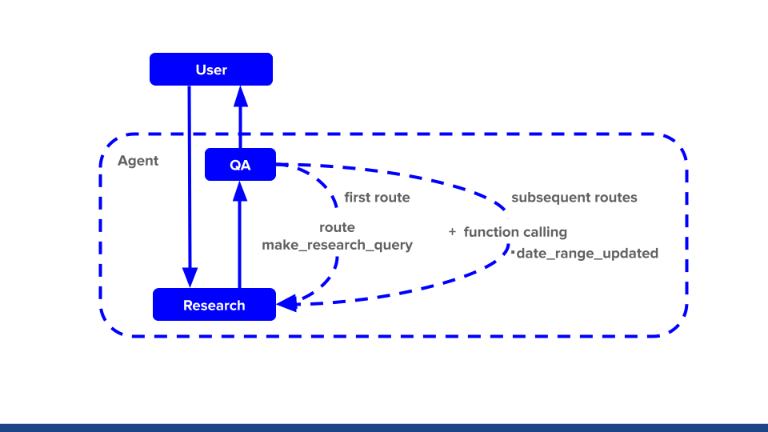

```python
!python3 -m pip install --upgrade pip
```

    Requirement already satisfied: pip in /usr/local/lib/python3.10/dist-packages (24.0)
    WARNING: Running pip as the 'root' user can result in broken permissions and conflicting behaviour with the system package manager. It is recommended to use a virtual environment instead: https://pip.pypa.io/warnings/venv
    


```python
!pip3 install arxiv==2.1.0
!pip3 install python-dotenv tiktoken
# !pip install openai==0.27.8
# !pip install openai==1.2.3
!pip install openai==1.3.4
!pip install -U duckduckgo-search==4.4
```

    Requirement already satisfied: arxiv==2.1.0 in /usr/local/lib/python3.10/dist-packages (2.1.0)
    Requirement already satisfied: feedparser==6.0.10 in /usr/local/lib/python3.10/dist-packages (from arxiv==2.1.0) (6.0.10)
    Requirement already satisfied: requests==2.31.0 in /usr/local/lib/python3.10/dist-packages (from arxiv==2.1.0) (2.31.0)
    Requirement already satisfied: sgmllib3k in /usr/local/lib/python3.10/dist-packages (from feedparser==6.0.10->arxiv==2.1.0) (1.0.0)
    Requirement already satisfied: charset-normalizer<4,>=2 in /usr/local/lib/python3.10/dist-packages (from requests==2.31.0->arxiv==2.1.0) (2.1.1)
    Requirement already satisfied: idna<4,>=2.5 in /usr/local/lib/python3.10/dist-packages (from requests==2.31.0->arxiv==2.1.0) (3.4)
    Requirement already satisfied: urllib3<3,>=1.21.1 in /usr/local/lib/python3.10/dist-packages (from requests==2.31.0->arxiv==2.1.0) (1.26.13)
    Requirement already satisfied: certifi>=2017.4.17 in /usr/local/lib/python3.10/dist-packages (from requests==2.31.0->arxiv==2.1.0) (2022.12.7)
    WARNING: Running pip as the 'root' user can result in broken permissions and conflicting behaviour with the system package manager. It is recommended to use a virtual environment instead: https://pip.pypa.io/warnings/venv
    Requirement already satisfied: python-dotenv in /usr/local/lib/python3.10/dist-packages (1.0.1)
    Requirement already satisfied: tiktoken in /usr/local/lib/python3.10/dist-packages (0.6.0)
    Requirement already satisfied: regex>=2022.1.18 in /usr/local/lib/python3.10/dist-packages (from tiktoken) (2023.12.25)
    Requirement already satisfied: requests>=2.26.0 in /usr/local/lib/python3.10/dist-packages (from tiktoken) (2.31.0)
    Requirement already satisfied: charset-normalizer<4,>=2 in /usr/local/lib/python3.10/dist-packages (from requests>=2.26.0->tiktoken) (2.1.1)
    Requirement already satisfied: idna<4,>=2.5 in /usr/local/lib/python3.10/dist-packages (from requests>=2.26.0->tiktoken) (3.4)
    Requirement already satisfied: urllib3<3,>=1.21.1 in /usr/local/lib/python3.10/dist-packages (from requests>=2.26.0->tiktoken) (1.26.13)
    Requirement already satisfied: certifi>=2017.4.17 in /usr/local/lib/python3.10/dist-packages (from requests>=2.26.0->tiktoken) (2022.12.7)
    WARNING: Running pip as the 'root' user can result in broken permissions and conflicting behaviour with the system package manager. It is recommended to use a virtual environment instead: https://pip.pypa.io/warnings/venv
    Requirement already satisfied: openai==1.3.4 in /usr/local/lib/python3.10/dist-packages (1.3.4)
    Requirement already satisfied: anyio<4,>=3.5.0 in /usr/local/lib/python3.10/dist-packages (from openai==1.3.4) (3.7.1)
    Requirement already satisfied: distro<2,>=1.7.0 in /usr/lib/python3/dist-packages (from openai==1.3.4) (1.7.0)
    Requirement already satisfied: httpx<1,>=0.23.0 in /usr/local/lib/python3.10/dist-packages (from openai==1.3.4) (0.26.0)
    Requirement already satisfied: pydantic<3,>=1.9.0 in /usr/local/lib/python3.10/dist-packages (from openai==1.3.4) (1.10.13)
    Requirement already satisfied: tqdm>4 in /usr/local/lib/python3.10/dist-packages (from openai==1.3.4) (4.66.1)
    Requirement already satisfied: typing-extensions<5,>=4.5 in /usr/local/lib/python3.10/dist-packages (from openai==1.3.4) (4.9.0)
    Requirement already satisfied: idna>=2.8 in /usr/local/lib/python3.10/dist-packages (from anyio<4,>=3.5.0->openai==1.3.4) (3.4)
    Requirement already satisfied: sniffio>=1.1 in /usr/local/lib/python3.10/dist-packages (from anyio<4,>=3.5.0->openai==1.3.4) (1.3.0)
    Requirement already satisfied: exceptiongroup in /usr/local/lib/python3.10/dist-packages (from anyio<4,>=3.5.0->openai==1.3.4) (1.2.0)
    Requirement already satisfied: certifi in /usr/local/lib/python3.10/dist-packages (from httpx<1,>=0.23.0->openai==1.3.4) (2022.12.7)
    Requirement already satisfied: httpcore==1.* in /usr/local/lib/python3.10/dist-packages (from httpx<1,>=0.23.0->openai==1.3.4) (1.0.2)
    Requirement already satisfied: h11<0.15,>=0.13 in /usr/local/lib/python3.10/dist-packages (from httpcore==1.*->httpx<1,>=0.23.0->openai==1.3.4) (0.14.0)
    WARNING: Running pip as the 'root' user can result in broken permissions and conflicting behaviour with the system package manager. It is recommended to use a virtual environment instead: https://pip.pypa.io/warnings/venv
    Requirement already satisfied: duckduckgo-search==4.4 in /usr/local/lib/python3.10/dist-packages (4.4)
    Requirement already satisfied: docstring-inheritance>=2.1.2 in /usr/local/lib/python3.10/dist-packages (from duckduckgo-search==4.4) (2.1.2)
    Requirement already satisfied: click>=8.1.7 in /usr/local/lib/python3.10/dist-packages (from duckduckgo-search==4.4) (8.1.7)
    Requirement already satisfied: curl-cffi>=0.6.0b7 in /usr/local/lib/python3.10/dist-packages (from duckduckgo-search==4.4) (0.6.0b9)
    Requirement already satisfied: lxml>=4.9.3 in /usr/local/lib/python3.10/dist-packages (from duckduckgo-search==4.4) (4.9.4)
    Requirement already satisfied: nest-asyncio>=1.6.0 in /usr/local/lib/python3.10/dist-packages (from duckduckgo-search==4.4) (1.6.0)
    Requirement already satisfied: cffi>=1.12.0 in /usr/local/lib/python3.10/dist-packages (from curl-cffi>=0.6.0b7->duckduckgo-search==4.4) (1.16.0)
    Requirement already satisfied: certifi in /usr/local/lib/python3.10/dist-packages (from curl-cffi>=0.6.0b7->duckduckgo-search==4.4) (2022.12.7)
    Requirement already satisfied: pycparser in /usr/local/lib/python3.10/dist-packages (from cffi>=1.12.0->curl-cffi>=0.6.0b7->duckduckgo-search==4.4) (2.21)
    WARNING: Running pip as the 'root' user can result in broken permissions and conflicting behaviour with the system package manager. It is recommended to use a virtual environment instead: https://pip.pypa.io/warnings/venv
    


```python
import os
import json
import datetime as dt
import yaml
import warnings


import arxiv
import openai
from openai import OpenAI
from dotenv import load_dotenv

from duckduckgo_search import DDGS, AsyncDDGS
import asyncio

# すべての警告を無視する
warnings.filterwarnings('ignore')
```


```python
from contextlib import contextmanager
from time import time

class Timer:
    """処理時間を表示するクラス
    with Timer(prefix=f'pred cv={i}'):
        y_pred_i = predict(model, loader=test_loader)
    
    with Timer(prefix='fit fold={} '.format(i)):
        clf.fit(x_train, y_train, 
                eval_set=[(x_valid, y_valid)],  
                early_stopping_rounds=100,
                verbose=verbose)

    with Timer(prefix='fit fold={} '.format(i), verbose=500):
        clf.fit(x_train, y_train, 
                eval_set=[(x_valid, y_valid)],  
                early_stopping_rounds=100,
                verbose=verbose)
    """
    def __init__(self, logger=None, format_str='{:.3f}[s]', prefix=None, suffix=None, sep=' ', verbose=0):

        if prefix: format_str = str(prefix) + sep + format_str
        if suffix: format_str = format_str + sep + str(suffix)
        self.format_str = format_str
        self.logger = logger
        self.start = None
        self.end = None
        self.verbose = verbose

    @property
    def duration(self):
        if self.end is None:
            return 0
        return self.end - self.start

    def __enter__(self):
        self.start = time()

    def __exit__(self, exc_type, exc_val, exc_tb):
        self.end = time()
        out_str = self.format_str.format(self.duration)
        if self.logger:
            self.logger.info(out_str)
        else:
            print(out_str)
```


```python
load_dotenv()
```


    True


```python
openai.api_key = os.getenv("OPENAI_API_KEY")
```


```python
MODEL_NAME = "gpt-3.5-turbo-0125"
# MODEL_NAME = "gpt-3.5-turbo-instruct"
# MODEL_NAME = "gpt-4-0125-preview"
TEMPERATURE = 0.7
# OpenAIクライアントの初期化
client = OpenAI()
```


```python
# 質問
# question = "禁闕の変について教えてください"

question = "今日の東京と稚内市の天気を教えてください"
```


```python
# 各ノードの名称を定義
RESEARCH_NODE = "research"
RE_RESEARCH_NODE = "re-research"
QUALITY_ASSURANCE_NODE = "quality_assurance"
WRITER_NODE = "writer"
SUPERVISOR_NODE = "supervisor"
```

## ノードの定義


```python
# チームメンバーの定義　特に使わないけど
"""
Researchノード: Web上から必要な情報を検索し、ユーザーからのリクエストに応じて記事を作成します。
Re-Researchノード: (QAでnot acceptだったら)問い合わせと直前の検索クエリから今まで使っていない検索クエリをを生成し、それを基にWeb上から必要な情報を検索し、ユーザーからのリクエストに応じて記事を作成します。
Quality Assurance (QA) ノード: 記事の品質が基準を満たしているかをチェックし、満たしていない場合はフィードバックを返します。品質の受け入れ基準は常にこのノードによって決定されます。
Writerノード: 世界最高レベルのAIチェッカーでも人間が書いたと判断されるような文章を作成します。
Supervisorノード: 会話を管理し、次に動作するワーカーを指示します。全てのタスクが完了したら、「FINISH」と応答します。
"""
team_members = [
    {"name": RESEARCH_NODE,
     "description": "Search the web for necessary information and write articles as requested by users."},
    {"name": RE_RESEARCH_NODE,
     "description": "Generate new search queries based on user inquiries and previous search queries that have not been used before, then search the web for necessary information to create articles as requested by users. Search the web for necessary information and write articles as requested by users."},
    {"name": QUALITY_ASSURANCE_NODE,
     "description": f"Check that the quality of the article meets the criteria. If not, return feedback. The acceptability of deliverables is always determined by {QUALITY_ASSURANCE_NODE}."},
    {"name": WRITER_NODE,
     "description": "Write articles that even the world's best AI checkers would judge as written by a human."},
]
```


```python
# エージェントに追加するシステムプロンプト作成関数
def create_agent_system(
        system_prompt: list,  # システムからエージェントへの初期プロンプト
        team_members: str,   # メンバーの役割
):
    # システムプロンプトに自律的な働きに関する指示を追加
    system_prompt.append({"role" : "system", "content" : "Work autonomously according to your specialty, using the tools available to you."})
    system_prompt.append({"role" : "system", "content" : " Do not ask for clarification."})
    system_prompt.append({"role" : "system", "content" : " Your other team members (and other teams) will collaborate with you with their own specialties."})
    system_prompt.append({"role" : "system", "content" : f" You are chosen for a reason! You are one of the following team members: {team_members}."})
    """
    あなたの専門分野に従って自律的に働いてください。使用可能なツールを使ってください
    確認のために質問をしないでください
    あなたの他のチームメンバーや他のチームも、それぞれの専門分野であなたと協力します
    あなたが選ばれたのには理由があります！あなたは以下のチームメンバーの一人です: {team_members}
    """
    # エージェントを実行するsystem_promptを返す
    return system_prompt
```


```python
# 使わないが
# チームのスーパーバイザーを生成する関数
def create_team_supervisor(
        model_name: str,
        system_prompt: list,
        members: list,  # チームメンバーのリスト
        job_result: str, # jobの結果
):
    # メンバー名のリストを生成
    member_names = [member["name"] for member in members]
    team_members = []
    # チームメンバーの名前と説明を文字列に整形
    for member in members:
        team_members.append(f"\n name: {member['name']}\n description: {member['description']}")
    options = ["FINISH"] + member_names  # 終了オプション
    
    # スーパーバイザー用のプロンプトテンプレートを作成
    superviser_prompt = []
    superviser_prompt.append({"role" : "system", "content" : "Given the conversation above, who should act next?"})
    superviser_prompt.append({"role" : "system", "content" : f" Or should we FINISH? Select one of option: {options}"})
    # team_membersからcontent文字列を作成
    content = 'List one of the choices as "name" and its description as "description" below.'
    # チームメンバーの名前と説明を文字列に整形
    for member in team_members:
        content += f"\n name: {member['name']}\n description: {member['description']}"
        superviser_prompt.append({"role" : "system", "content" : f"{content}"})
    superviser_prompt.append({"role": "user", "content": 'Please generate JSON from the text of job results. Use "supervisor_result" as the schema, and use one of {options} as the key to generate it in the form {"supervisor_result": {option}}.'})
    superviser_prompt.append({"role": "user", "content": f"Text of job results: {job_result}"})
    """
    システム
    上記の会話を踏まえて、次に行動すべきは誰ですか？
    選ぶ選択肢の一つを"name"として、その説明を"description"として以下に記載します。\n name: {member['name']}\n description: {member['description']}\n
    それとも、終了すべきですか？次の選択肢の中から一つ選んでください: {options}
    
    user
    次のジョブ結果のテキストからJSONを生成してください。「supervisor_result」をスキーマとして使用し、{options}のうちの一つをキーとして使って、形式が{"supervisor_result": {option}}となるように生成してください。
    ジョブ結果のテキスト: {job_result}
    """
    # スーパーバイザー用のプロンプトテンプレートを作成
    response = client.chat.completions.create(
        model=model_name, # model = "deployment_name".
        messages=superviser_prompt,
        response_format={ "type": "json_object" },
        temperature=TEMPERATURE,
    )
    # print(response.choices[0].message.content)
    
    # スーパーバイザーの機能をバインドし、JSON出力を解析するパイプラインを作成
    return response.choices[0].message.content
```

## Researchエージェントの定義


```python
# テキスト検索用の関数
def search_text(keywords, region='wt-wt', safesearch='moderate', timelimit=None, max_results=10):
    with DDGS() as ddgs:
        results = [r for r in ddgs.text(keywords, region=region, safesearch=safesearch, timelimit=timelimit, max_results=max_results)]
    return results

# 画像検索用の関数
def search_images(keywords, region='wt-wt', safesearch='moderate', size=None, color=None, max_results=10):
    with DDGS() as ddgs:
        results = [r for r in ddgs.images(keywords, region=region, safesearch=safesearch, size=size, color=color, max_results=max_results)]
    return results

# 非同期テキスト検索用の関数
def async_search_text(keywords, max_results=10):
    with AsyncDDGS() as ddgs:
        results = [r for r in ddgs.text(keywords, max_results=max_results)]
    return results


# # 使用例: テキスト検索
# text_results = search_text(question)
# for result in text_results:
#     print(result)

# # 使用例: 画像検索
# image_results = search_images('cats', color='Monochrome', max_results=5)
# for result in image_results:
#     print(result)
```


```python

```


```python
# Researchノードの定義
def research_node(
        model_name: str,
        job_result: str, # search の結果
):
    # リサーチエージェントを呼び出し、結果を取得
    # あなたは、DuckDuckGo検索エンジンを使って、検索された情報を順番に確認し、ポイントを外さずに思慮深く要約するリサーチアシスタントです。
    prompt = [{'role': 'system', 'content': "You are a research assistant who uses the DuckDuckGo search engine to review the information retrieved in sequence and summarize it thoughtfully without missing the point."}]
    prompt.append({"role": "system", "content": "Summary results must be in Japanese."})
    
    research_prompt = create_agent_system(prompt, RESEARCH_NODE)
    research_prompt.append({"role": "system", "content": 'Please generate JSON from the following search result text. Generate in the format {"supervisor_result": summarized results} using "search_result" as the schema and summarized results as the keys.'})
    research_prompt.append({"role": "user", "content": 'Please generate JSON from the text of search job results. Use "research_result" as the schema, and use one of summarized results as the key to generate it in the form {"research_result": summarized results}.'})
    research_prompt.append({"role": "user", "content": f"Text of search job results: {job_result}"})
    """
    システム
    あなたは、DuckDuckGo検索エンジンを使って、検索された情報を順番に確認し、ポイントを外さずに思慮深く要約するリサーチアシスタントです。
    要約結果は日本語でなければならない。
    
    あなたの専門分野に従って自律的に働いてください。使用可能なツールを使ってください
    確認のために質問をしないでください
    あなたの他のチームメンバーや他のチームも、それぞれの専門分野であなたと協力します
    あなたが選ばれたのには理由があります！あなたは以下のチームメンバーの一人です: {team_members}
    以下の検索結果のテキストからJSONを生成してください。スキーマとして「search_result」、キーとして「summarized results」を使用し、{"supervisor_result": summarized results}の形式で生成してください。
    user
    以下の検索結果のテキストからJSONを生成する。スキーマとして "search_result "を使用し、キーとして要約された結果を使用して、{"supervisor_result": 要約された結果}というフォーマットで生成します。
    search ジョブ結果のテキスト: {job_result}
    """
    
    # Research用のプロンプトテンプレートを作成
    response = client.chat.completions.create(
        model=model_name, # model = "deployment_name".
        messages=research_prompt,
        response_format={ "type": "json_object" },
        temperature=TEMPERATURE,
    )
    search_res_str = response.choices[0].message.content
    # print(search_res_str)
    
    # JSON形式の文字列を辞書に変換
    search_res = json.loads(search_res_str)
    
    # 出力と新しいメッセージをステートに反映
    return {
        "output": search_res["research_result"],
        "messages": job_result
    }
```


```python
# 再検索用クエリを抽出
def make_re_search_query(
    model_name: str,
    question: str,    # 最初の質問
    before_query: str,   # 直前の検索クエリ 初回は question
):
    
    # questionから検索クエリを作成する。before_queryと違うものクエリを作成する
    # テキストのブロックが提供されます。あなたのタスクは、そこからキーワードのリストを抽出することです。
    prompt = [{'role': 'system', 'content': "You will be provided with a block of text, and your task is to extract a list of keywords from it."}]
    
    prompt.append({"role": "system", "content": "Use the following example to extract a list of keywords.\n###Example###\n\nuser's question: Black-on-black ware is a 20th- and 21st-century pottery tradition developed by the Puebloan Native American ceramic artists in Northern New Mexico. Traditional reduction-fired blackware has been made for centuries by pueblo artists. Black-on-black ware of the past century is produced with a smooth surface, with the designs applied through selective burnishing or the application of refractory slip. Another style involves carving or incising designs and selectively polishing the raised areas. For generations several families from Kha'po Owingeh and P'ohwhóge Owingeh pueblos have been making black-on-black ware with the techniques passed down from matriarch potters. Artists from other pueblos have also produced black-on-black ware. Several contemporary artists have created works honoring the pottery of their ancestors.\n\nresult query: {      'query_result': 'Black-on-black ware, pottery tradition, Puebloan Native American, ceramic artists, Northern New Mexico, reduction-fired blackware, pueblo artists, smooth surface, designs, selective burnishing, refractory slip, carving, incising designs, polishing, generations, families, Kha'po Owingeh, P'ohwhóge Owingeh pueblos, matriarch potters, contemporary artists, ancestors'}"})
    """
    Use the following example to extract a list of keywords.
    ###Example###
    
    user's question: Black-on-black ware is a 20th- and 21st-century pottery tradition developed by the Puebloan Native American ceramic artists in Northern New Mexico. Traditional reduction-fired blackware has been made for centuries by pueblo artists. Black-on-black ware of the past century is produced with a smooth surface, with the designs applied through selective burnishing or the application of refractory slip. Another style involves carving or incising designs and selectively polishing the raised areas. For generations several families from Kha'po Owingeh and P'ohwhóge Owingeh pueblos have been making black-on-black ware with the techniques passed down from matriarch potters. Artists from other pueblos have also produced black-on-black ware. Several contemporary artists have created works honoring the pottery of their ancestors.
    
    result query: 
    {
      "query_result": "Black-on-black ware, pottery tradition, Puebloan Native American, ceramic artists, Northern New Mexico, reduction-fired blackware, pueblo artists, smooth surface, designs, selective burnishing, refractory slip, carving, incising designs, polishing, generations, families, Kha'po Owingeh, P'ohwhóge Owingeh pueblos, matriarch potters, contemporary artists, ancestors"
    }
    """
    prompt.append({'role': 'system', 'content': "Generate queries that are as different as possible from the query used in the previous search for extracting the list of keywords."})
    prompt.append({'role': 'system', 'content': f"The query used in the previous search was '{before_query}'."})

    prompt.append({"role": "user", "content": "Generate JSON from search result text. Use 'query_result' as the schema, generate in the format {'query_result': Result extract keywords from a block of text.}, and key in the evaluation results, such as whether the generated search results describe the user's request."})
    prompt.append({"role": "user", "content": f"user's question:{question}. Result extract keywords from a block of text.:"})
    

    """
    system
    以下の例を参考にキーワードのリストを抽出してください。
    
    ###Example###
    
    user's question: 黒地に黒の陶器は、ニューメキシコ州北部のプエブロ人ネイティブ アメリカンの陶芸家によって発展した、20 世紀から 21 世紀にかけての陶器の伝統です。伝統的な還元焼成黒食器は、プエブロの芸術家によって何世紀にもわたって作られてきました。前世紀の黒地に黒の陶器は、選択的に磨きをかけたり、耐火物スリップを塗布したりすることによってデザインが施され、滑らかな表面で製造されています。別のスタイルには、デザインを彫刻または切り込み、盛り上がった領域を選択的に研磨することが含まれます。カポ オウィンゲとポホゲ オウィンゲ プエブロの数家族が、家長の陶芸家から受け継がれた技術を用いて、黒地に黒の陶器を何世代にもわたって作り続けてきました。他のプエブロ出身の芸術家も黒地に黒の陶器を制作しています。何人かの現代芸術家は、祖先の陶器に敬意を表して作品を制作しました。
    
    result query: 
    {
      'query_result': '黒地に黒の器、陶器の伝統、プエブロのネイティブ アメリカン、陶芸家、ニューメキシコ北部、還元焼成黒器、プエブロの芸術家、滑らかな表面、デザイン、選択的バニシング、耐火物スリップ、彫刻、切り込みデザイン、研磨、世代、家族、カポ・オウィンゲ、ポホゲ・オウィンゲ・プエブロス、女家長陶芸家、現代芸術家、先祖'
    }
    
    キーワードリストを抽出するために、前回の検索で使用したクエリとはできるだけ異なるクエリを生成する。
    前回の検索で使用したクエリは「{before_query}」です。
    user
    検索結果のテキストからJSONを生成する。スキーマとして "query_result"を使用し、{"query_result"： テキストブロックからキーワードを抽出した結果}の形式で生成する。
    
    前回の検索で使用したクエリ: "{before_query}".

    
    user's question:{}. result query:
    """
    
    # Research用のプロンプトテンプレートを作成
    response = client.chat.completions.create(
        model=model_name, # model = "deployment_name".
        messages=prompt,
        response_format={ "type": "json_object" },
        temperature=TEMPERATURE+TEMPERATURE,
    )
    res_str = response.choices[0].message.content
    # print(res_str)
    
    # JSON形式の文字列を辞書に変換
    res = json.loads(res_str)
    
    # 出力と新しいメッセージをステートに反映
    return {
        "output": res["query_result"],
        "before_query": before_query
    }
```


```python
# test_query = make_re_search_query(
#     MODEL_NAME,
#     question,
#     question
# )
# test_query['output']
```


```python
# Re-Researchノードの定義
# ###Instruction###で始め、次に関連する場合は###Example###または'###Question###
def re_research_node(
    model_name: str,
    question: str,    # 最初の質問
    before_query: str,   # 直前の検索クエリ 初回は question
    before_job_result: str, # 直前のsearch の結果
):
    # re-search 用クエリ
    re_query = make_re_search_query(
        MODEL_NAME,
        question,
        before_query
    )
    re_query = re_query['output']
    
    # search
    re_search = ""
    text_results = search_text(re_query)
    for result in text_results:
        re_search += result["body"] + ", "
        print(re_search["body"])
    
    # search_node
    research_res = research_node(
        MODEL_NAME,
        search, # search の結果
    )
    research_res['output']
    
    # 出力と新しいメッセージをステートに反映
    return {
        "output": research_res['output'],
        "re_query": re_query
    }
```


```python
# 品質チェックノードの定義
def qa_node(
    model_name: str,
    question:str, # 検索結果
    research_output:str, # 検索結果
):
    # 品質チェックの指示を含むシステムメッセージ
#     system_message = """You are a specialist in inspecting the quality of articles. 
#     Inspect the article to see if it meets the following requirements:

#     - The article is written in Japanese.
#     - The writing style MUST be such that the AI sentence checker determines that it was written by a HUMAN.
#     - The article MUST be written in a way that is easy to understand.
#     - The article MUST meet the user's requirements.

#     If the evaluation criteria are met, write 'Acceptable'.
#     In addition, write the reason why you judged that the evaluation criteria are met.

#     If the evaluation criteria are not met, write 'Not Acceptable'.
#     In addition, provide feedback on what needs to be done to meet the evaluation criteria.

#     DO NOT make excuses such as 'I can't make a decision because I am an AI'.

#     The quality of your articles is relevant to your career.
#     Please be as rigorous as possible in your inspections and make sure that your feedback is helpful in making corrections.
#     """
    prompt = [{'role': 'system', 'content': "You are a specialist in inspecting the quality of articles. Inspect the article to see if it meets the following requirements: The article is written in Japanese."}]
    prompt.append({'role': 'system', 'content': "You are a specialist in inspecting the quality of articles. Inspect the article to see if it meets the following requirements: The writing style MUST be such that the AI sentence checker determines that it was written by a HUMAN."})
    prompt.append({'role': 'system', 'content': "You are a specialist in inspecting the quality of articles. Inspect the article to see if it meets the following requirements: The article MUST be written in a way that is easy to understand."})
    prompt.append({'role': 'system', 'content': "You are a specialist in inspecting the quality of articles. Inspect the article to see if it meets the following requirements: The article MUST meet the user's requirements."})

    prompt.append({'role': 'system', 'content': "You are a specialist in inspecting the quality of articles. Inspect the article to see if it meets the following requirements: If the evaluation criteria are met, write 'Acceptable'."})
    prompt.append({'role': 'system', 'content': "You are a specialist in inspecting the quality of articles. Inspect the article to see if it meets the following requirements: In addition, write the reason why you judged that the evaluation criteria are met."})
  
    prompt.append({'role': 'system', 'content': "You are a specialist in inspecting the quality of articles. Inspect the article to see if it meets the following requirements: If the evaluation criteria are not met, write 'Not Acceptable'."})
    prompt.append({'role': 'system', 'content': "You are a specialist in inspecting the quality of articles. Inspect the article to see if it meets the following requirements: In addition, provide feedback on what needs to be done to meet the evaluation criteria."})

    prompt.append({'role': 'system', 'content': "You are a specialist in inspecting the quality of articles. Inspect the article to see if it meets the following requirements: DO NOT make excuses such as 'I can't make a decision because I am an AI'."})
  
    prompt.append({'role': 'system', 'content': "You are a specialist in inspecting the quality of articles. Inspect the article to see if it meets the following requirements: The quality of your articles is relevant to your career."})
    prompt.append({'role': 'system', 'content': "You are a specialist in inspecting the quality of articles. Inspect the article to see if it meets the following requirements: Please be as rigorous as possible in your inspections and make sure that your feedback is helpful in making corrections."})

    # prompt = [{'role': 'system', 'content': system_message}]
    qa_prompt = create_agent_system(prompt, QUALITY_ASSURANCE_NODE)
    qa_prompt.append({"role": "user", "content": "Generate JSON from search result text. Use 'qa_result' as the schema, generate in the format {'qa_result': Acceptable or Not Acceptable}, and key in the evaluation results, such as whether the generated search results describe the user's request."})
    qa_prompt.append({"role": "user", "content": f"user's requirements:{question}. search result text: {research_output}"})
    

    """
    評価基準の適用例:
    1. 言語と文章スタイルの評価:
        - 記事が日本語で書かれているか。
        - 文章が人間によって書かれたとAI文章チェッカーに判断させるスタイルであるか。
    2. 内容の理解しやすさ:
        - 記事の内容が簡潔に、かつ明確に表現されているか。
        - 専門用語が適切に説明され、一般の読者も理解できるようになっているか。
    3. ユーザーの要件への適合性:
        - 記事がユーザーの要求や指定したテーマに沿っているか。
        - ユーザーが期待する情報や視点が適切に取り入れられているか。
    評価例:
    - 受理可能: 記事は全ての評価基準を満たしています。日本語で書かれており、文章スタイルは人間によるものと判断できます。
    内容は理解しやすく、ユーザーの要件にも適合しています。これらの点から、記事は受理可能と判断します。
    - 受理不可: 記事は一部の評価基準を満たしていません。特に、文章スタイルがAIによって書かれたように見える部分があります。
    また、専門用語の説明が不足しているため、内容の理解が難しい箇所があります。これらの問題を解決するためには、人間らしい表現を増やし、専門用語に対する説明を追加する必要があります。
    user
    検索結果のテキストからJSONを生成する。スキーマとして "qa_result"を使用し、{"qa_result"： Acceptable or Not Acceptable}の形式で生成し、生成された検索結果をキーとして評価する。
    user's requirements:{}. 検索結果のテキスト: {research_output}
    """
    
    # Research用のプロンプトテンプレートを作成
    response = client.chat.completions.create(
        model=model_name, # model = "deployment_name".
        messages=qa_prompt,
        response_format={ "type": "json_object" },
        temperature=TEMPERATURE,
    )
    qa_res_str = response.choices[0].message.content
    # print(qa_res_str)
    
    # JSON形式の文字列を辞書に変換
    qa_res = json.loads(qa_res_str)
    """
    "qa_result": "Not Acceptable" だったら戻り値に次の検索ワードを入れるか、質問と分割するかとかしたい
    """
    # 出力と新しいメッセージをステートに反映
    return {
        "output": qa_res["qa_result"]
    }
```


```python

```


```python
# # 使用例: 1サイクル
# with Timer(prefix=f'Processing time for one cycle.'):
#     question = "今日の東京と稚内市の天気を教えてください"

#     search = ""
#     text_results = search_text(question)
#     for result in text_results:
#         search += result["body"] + ", "
#         # print(result["body"])

#     # search_node
#     research_res = research_node(
#         MODEL_NAME,
#         search, # search の結果
#     )
#     research_output = research_res['output']
#     print(f"検索して質問に回答した結果: {research_output}")

#     qa_res = qa_node(
#         MODEL_NAME,
#         question,
#         research_output
#     )
#     print(f"質問と回答の整合性チェック: {qa_res}")

```

検索して質問に回答した結果: 稚内市の天気予報に関する情報が提供されており、今日・明日の天気や気温、降水確率、注意報などが記載されている。また、稚内市のPM2.5分布予測や地震情報、スキー積雪情報なども含まれている。

質問と回答の整合性チェック: {'output': 'Not Acceptable'}

Processing time for one cycle. 5.816[s]


```python
def search_agent_1cycle(
    question: str,
    query: str,
):
    search = ""
    text_results = search_text(query)
    for result in text_results:
        search += result["body"] + ", "
        # print(result["body"])

    # search_node
    research_res = research_node(
        MODEL_NAME,
        search, # search の結果
    )
    research_output = research_res['output']

    qa_res = qa_node(
        MODEL_NAME,
        question,
        research_output
    )
    
    
    return {
        "output": research_output,
        "qa_result": qa_res
    }
```

検索クエリを具体化する道具


```python
functions = \
[
    {
        # 【日付範囲の特定】
        # 関数名
        "name": "date_range_from_word_updated_fixed",
        # 関数の説明
        "description": "与えられた単語から日付の範囲を特定し、文字列で返す。",
        # 関数の引数の定義
        "parameters":
         {
            "type": "object",
            "properties":
             {
                "word":
                {
                    "type": "string",
                    "description": "日付範囲を示唆する単語や文章。例えば、「最近」、「今年」、「今週」、「来週」、「昨日」、または「未来」といったキーワードが含まれる文章が入ります。"
                }
            },
            "required": ["word"],
        }
    },
]

```


```python
def date_range_from_word_updated_fixed(word):
    # 現在の日時を取得
    now = dt.datetime.now()
    # 日付の範囲を格納する変数を初期化
    date_range = ""
    
    if "最近" in word:
        six_months_ago = now - dt.timedelta(days=182) # 大体半年前
        date_range = f"{six_months_ago.strftime('%Y-%m-%d')}から{now.strftime('%Y-%m-%d')}まで"
    
    elif word == "今年":
        start_of_year = dt.datetime(now.year, 1, 1)
        end_of_year = dt.datetime(now.year, 12, 31)
        date_range = f"{start_of_year.strftime('%Y-%m-%d')}から{end_of_year.strftime('%Y-%m-%d')}まで"
    
    elif word == "今週":
        start_of_week = now - dt.timedelta(days=now.weekday())
        end_of_week = start_of_week + dt.timedelta(days=6)
        date_range = f"{start_of_week.strftime('%Y-%m-%d')}から{end_of_week.strftime('%Y-%m-%d')}まで"
    
    elif word == "来週":
        start_of_next_week = now + dt.timedelta(days=(7 - now.weekday()))
        end_of_next_week = start_of_next_week + dt.timedelta(days=6)
        date_range = f"{start_of_next_week.strftime('%Y-%m-%d')}から{end_of_next_week.strftime('%Y-%m-%d')}まで"
    
    elif word == "昨日":
        yesterday = now - dt.timedelta(days=1)
        date_range = yesterday.strftime('%Y-%m-%d')
    
    elif "未来" in word:
        future_time = word.replace("未来", "").strip()
        if future_time == "":
            start_of_next_year = dt.datetime(now.year + 1, 1, 1)
            end_of_next_year = dt.datetime(now.year + 1, 12, 31)
            date_range = f"{now.strftime('%Y-%m-%d')}から{start_of_next_year.strftime('%Y-%m-%d')}まで"
        elif future_time.isdigit():
            future_date = now + dt.timedelta(days=365 * int(future_time))
            date_range = future_date.strftime('%Y-%m-%d')
        else:
            # 不正確な入力に対する処理を追加するか、エラーメッセージを表示する
            return word
    elif "これから" in word:
        future_time = word.replace("これから", "").strip()
        if future_time == "":
            start_of_next_year = dt.datetime(now.year + 1, 1, 1)
            end_of_next_year = dt.datetime(now.year + 1, 12, 31)
            date_range = f"{now.strftime('%Y-%m-%d')}から{start_of_next_year.strftime('%Y-%m-%d')}まで"
        elif future_time.isdigit():
            future_date = now + dt.timedelta(days=365 * int(future_time))
            date_range = future_date.strftime('%Y-%m-%d')
        else:
            # 不正確な入力に対する処理を追加するか、エラーメッセージを表示する
            return word
    elif "将来" in word:
        future_time = word.replace("将来", "").strip()
        if future_time == "":
            start_of_next_year = dt.datetime(now.year + 1, 1, 1)
            end_of_next_year = dt.datetime(now.year + 1, 12, 31)
            date_range = f"{now.strftime('%Y-%m-%d')}から{start_of_next_year.strftime('%Y-%m-%d')}まで"
        elif future_time.isdigit():
            future_date = now + dt.timedelta(days=365 * int(future_time))
            date_range = future_date.strftime('%Y-%m-%d')
        else:
            # 不正確な入力に対する処理を追加するか、エラーメッセージを表示する
            return word
        
    elif "最新" in word:
        # 「最新の」処理
        six_months_ago = now - dt.timedelta(days=182) # 大体半年前
        date_range = f"{six_months_ago.strftime('%Y-%m-%d')}から{now.strftime('%Y-%m-%d')}までの{word.replace('最新', '')}"
    
    elif "今年" in word:
        # 「今年の」処理
        start_of_year = dt.datetime(now.year, 1, 1)
        end_of_year = dt.datetime(now.year, 12, 31)
        date_range = f"{start_of_year.strftime('%Y-%m-%d')}から{end_of_year.strftime('%Y-%m-%d')}までの{word.replace('今年', '')}"
    
    else:
        # 日付のわかるワードがない場合はそのまま返す
        return word
    
    return date_range

```


```python
# # テスト
# print(date_range_from_word_updated_fixed("最近"))
# print(date_range_from_word_updated_fixed("今年"))
# print(date_range_from_word_updated_fixed("今週"))
# print(date_range_from_word_updated_fixed("来週"))
# print(date_range_from_word_updated_fixed("昨日"))
# print(date_range_from_word_updated_fixed("未来"))
# print(date_range_from_word_updated_fixed("未来50年後"))
# print(date_range_from_word_updated_fixed("未来5日後"))
# print(date_range_from_word_updated_fixed("最新のAIトレンド"))
# print(date_range_from_word_updated_fixed("今年のファッショントレンド"))
```


```python
# 関数を選択して実行するデモ関数
def function_calling_query_change(prompt):

    # GPTにプロンプトと関数定義リストを一緒に投入し、Function callingの使用を指示
    response = client.chat.completions.create(
        model=MODEL_NAME,
        temperature=TEMPERATURE,
        messages=
    	[
    		{ "role": "user", "content": prompt}  # プロンプトを投入
    	],
        functions=functions, # プロンプトと一緒に関数定義リストを投入
        function_call="auto", # Function callingを使用するが、その際、関数の選択はGPTに任せる
    )

    # GPTからの応答を抽出
    message = response.choices[0].message
    function_call = message.function_call
    if function_call is not None:
        # 実行すべき関数名
        function_name = function_call.name
        # その関数に渡すべき引数
        # arguments = json.loads(function_call.arguments)
        # promptを直接引数として使用
        arguments = {"word": prompt}
    
        # 関数の選択と実行
        if function_name == "date_range_from_word_updated_fixed":
            # date_range_from_word_updated_fixed関数を実行
            function_response = date_range_from_word_updated_fixed(arguments["word"])
            answer = function_response
        else:
            # 他の関数が選択された場合の処理
            # この例では、選択された関数がdate_range_from_word_updated_fixedのみであるため、他の分岐は省略
            # answer = "該当する関数がありません。"
            answer = prompt
    else:
        answer = prompt
    return answer
```


```python
def research_agent(
    question:str,
):
    query = question
    search_res = search_agent_1cycle(question, query)

    print(f"検索結果を要約した回答: {search_res['output']}")
    print(f"質問と回答の整合性チェック: {search_res['qa_result']['output']}")

    # カウント用変数の初期化
    research_cnt = 0
    # outputが'Not Acceptable'である間、処理を繰り返す
    while search_res['qa_result']['output']  == 'Not Acceptable':
        print("-"*50)
        with Timer(prefix=f'Number of re-researches {research_cnt+1} :'):
            # カウントアップ
            research_cnt += 1
            # カウントが3に達したらループを強制終了
            if research_cnt == 4:
                print("実行回数が3に達したため、処理を終了します。")
                break
            # 再検索用のクエリ生成
            re_query = make_re_search_query(
                MODEL_NAME,
                question,
                query
            )
            
            query = re_query['output']
            # function_callingによる検索クエリ変換
            if research_cnt != 1:
                with Timer(prefix=f'function calling change {research_cnt}:'):
                    query_list = query.split(",")
                    query_re_list = []
                    for q in query_list:
                        f_c_q = function_calling_query_change(q)
                        query_re_list.append(f_c_q)

                    query = ", ".join(query_re_list).strip()
                
            print(f"再検索クエリ: {query}")

            search_res = search_agent_1cycle(question, query)

            print(f"検索結果を要約した回答: {search_res['output']}")
            print(f"質問と回答の整合性チェック: {search_res['qa_result']['output']}")
        print("-"*50)
    return {
        "final_qa": search_res['qa_result']['output'],
        "final_query": query,
        "search_output": search_res['output']
    }
```


```python

```


```python
def get_summary_of_search_results(question, search_res):
    print("-"*50)
    print(f"質問: {question}")
    print("-"*50)
    print(f"検索に使用したクエリ:\n {research_res['final_query']}")
    print(f"検索結果を要約した最終回答:\n {research_res['search_output']}")
    print(f"最終判定結果: {research_res['final_qa']}")
    print("-"*50)
    print(f"使用モデル: {MODEL_NAME}")
```


```python
question = """2024年に注目されている最新のテクノロジートレンドは何ですか？
また、それらのトレンドが社会にどのような影響を与えると予想されますか？"""
with Timer(prefix=f'Handle all time by research.'):
    research_res = research_agent(question)
```

    検索結果を要約した回答: 2024年の戦略的テクノロジのトップ・トレンドは、「投資の保護」 (既存および将来の投資を保護／保全する)、「ビルダーの台頭」 (適切なステークホルダー向けに、適切なソリューションを、適切なタイミングで構築する)、「価値のデリバー」 (社内外の顧客の環境変化に応じて価値を提供する) という3つの包括的なビジネス・テーマの1つまたは複数に関連します。
    質問と回答の整合性チェック: Not Acceptable
    --------------------------------------------------
    再検索クエリ: 2024年, 最新, テクノロジートレンド, 社会, 影響, 予想
    検索結果を要約した回答: 2024年の戦略的テクノロジのトップ・トレンドは、「投資の保護」 (既存および将来の投資を保護／保全する)、「ビルダーの台頭」 (適切なステークホルダー向けに、適切なソリューションを、適切なタイミングで構築する)、「価値のデリバー」 (社内外の顧客の環境変化に応じて価値を提供する) という3つの包括的なビジネス・テーマの1つまたは複数に関連します。 リサーチサービスに関するお問い合わせ ガートナーはお客様にマネジメントやテクノロジに関する実績のあるリサーチへのアクセスをご提供します。 ガートナーのプロダクトおよびサービスにご興味ありましたら、下記よりお問い合わせください。 登録フォームへ テーマ1：投資の保護, テクノロジービジョン2024 人間性を組み込む 15分（読了目安時間) 2024/01/09 概略 テクノロジーに人間性を意識的、意図的に組み込んでいく。 こうした対応策を講じている企業は将来的にビジネスで成功を収める可能性が高いでしょう。 AIを搭載したチャットボットが膨大な情報をもとに、まるで人間であるかのように回答やアドバイスを提供するようになる中、私たちの情報へのアプローチやかかわり方は根本的に変わります。 まもなく、AIエージェントの包括的エコシステムが構成され、AIは我々と同じように思考しているかのように、互いに協力し合うと共に、人間や組織のために行動するようになるでしょう。 新しい空間コンピューティングの媒体が出現します。, 2024年、ビジネスの両翼を担う「Deep Tech」、そして「Deepな"信頼"」。 生成AIの時代に すべての組織がどこで、どのように、そしてなぜ「信頼」を築く必要があるのか解説します。, 2024年の戦略的テクノロジのトップ・トレンド は、「 投資の保護 」「 ビルダーの台頭 」「 価値のデリバー 」の3つの包括的なテーマで捉えることができます。 「 投資の保護 」に含まれるトレンドは、より信頼のできる、安全に使える、そしてESG (環境、社会、ガバナンス) にも配慮した持続可能な未来を形作ります。 「 ビルダーの台頭 」に含まれるトレンドは、アプリケーションやサービスの開発および運用に関わるすべての人が、効率的で創造的な力を発揮できるような環境の構築を目指します。 「 価値のデリバー 」に含まれるトレンドは、これからの時代により求められる迅速でより賢い意思決定を行うため、あるいはこれからの時代にふさわしい新たなエクスペリエンスに移行するためのトレンドです。, ガートナーは最新発表で 2024年のテクノロジートレンド として、10のトピックを挙げている。 やはり2024年もAI関連のトピックが大半を占めるが、サステナビリティやサイバーセキュリティ分野でも注目されるテクノロジートレンドが生まれる見込みだ。 AI関連で特にガートナーが注目しているのは「AI TRiSM」トレンドだ。 AI TRiSMとは、AIのtrust（信頼）、risk（リスク）、security management（セキュリティ・マネジメント）に関するフレームワークで、企業がAIを活用する際に検討すべき項目を指し示すガイドラインとなる。
    質問と回答の整合性チェック: Acceptable
    Number of re-researches 1 : 20.783[s]
    --------------------------------------------------
    Handle all time by research. 26.306[s]


```python
get_summary_of_search_results(question, research_res)
```

    --------------------------------------------------
    質問: 2024年に注目されている最新のテクノロジートレンドは何ですか？
    また、それらのトレンドが社会にどのような影響を与えると予想されますか？
    --------------------------------------------------
    検索に使用したクエリ:
     2024年, 最新, テクノロジートレンド, 社会, 影響, 予想
    検索結果を要約した最終回答:
     2024年の戦略的テクノロジのトップ・トレンドは、「投資の保護」 (既存および将来の投資を保護／保全する)、「ビルダーの台頭」 (適切なステークホルダー向けに、適切なソリューションを、適切なタイミングで構築する)、「価値のデリバー」 (社内外の顧客の環境変化に応じて価値を提供する) という3つの包括的なビジネス・テーマの1つまたは複数に関連します。 リサーチサービスに関するお問い合わせ ガートナーはお客様にマネジメントやテクノロジに関する実績のあるリサーチへのアクセスをご提供します。 ガートナーのプロダクトおよびサービスにご興味ありましたら、下記よりお問い合わせください。 登録フォームへ テーマ1：投資の保護, テクノロジービジョン2024 人間性を組み込む 15分（読了目安時間) 2024/01/09 概略 テクノロジーに人間性を意識的、意図的に組み込んでいく。 こうした対応策を講じている企業は将来的にビジネスで成功を収める可能性が高いでしょう。 AIを搭載したチャットボットが膨大な情報をもとに、まるで人間であるかのように回答やアドバイスを提供するようになる中、私たちの情報へのアプローチやかかわり方は根本的に変わります。 まもなく、AIエージェントの包括的エコシステムが構成され、AIは我々と同じように思考しているかのように、互いに協力し合うと共に、人間や組織のために行動するようになるでしょう。 新しい空間コンピューティングの媒体が出現します。, 2024年、ビジネスの両翼を担う「Deep Tech」、そして「Deepな"信頼"」。 生成AIの時代に すべての組織がどこで、どのように、そしてなぜ「信頼」を築く必要があるのか解説します。, 2024年の戦略的テクノロジのトップ・トレンド は、「 投資の保護 」「 ビルダーの台頭 」「 価値のデリバー 」の3つの包括的なテーマで捉えることができます。 「 投資の保護 」に含まれるトレンドは、より信頼のできる、安全に使える、そしてESG (環境、社会、ガバナンス) にも配慮した持続可能な未来を形作ります。 「 ビルダーの台頭 」に含まれるトレンドは、アプリケーションやサービスの開発および運用に関わるすべての人が、効率的で創造的な力を発揮できるような環境の構築を目指します。 「 価値のデリバー 」に含まれるトレンドは、これからの時代により求められる迅速でより賢い意思決定を行うため、あるいはこれからの時代にふさわしい新たなエクスペリエンスに移行するためのトレンドです。, ガートナーは最新発表で 2024年のテクノロジートレンド として、10のトピックを挙げている。 やはり2024年もAI関連のトピックが大半を占めるが、サステナビリティやサイバーセキュリティ分野でも注目されるテクノロジートレンドが生まれる見込みだ。 AI関連で特にガートナーが注目しているのは「AI TRiSM」トレンドだ。 AI TRiSMとは、AIのtrust（信頼）、risk（リスク）、security management（セキュリティ・マネジメント）に関するフレームワークで、企業がAIを活用する際に検討すべき項目を指し示すガイドラインとなる。
    最終判定結果: Acceptable
    --------------------------------------------------
    使用モデル: gpt-3.5-turbo-0125


```python
MODEL_NAME = "gpt-4-0125-preview"

question = """最近世界の異なる国々で行われているユニークな新年の祝い方を3つ挙げ、
それぞれの文化的背景を説明してください。"""

with Timer(prefix=f'Handle all time by research.'):
    research_res = research_agent(question)
```

    検索結果を要約した回答: {'日本のお正月': '初詣では新年に神社や寺を訪れ、一年の幸福や健康を祈願します。鏡開きは、正月に飾った鏡餅を開いて食べる行事で、家族の絆や豊穣を願うものです。', '世界のお正月': '各国では独自の新年の祝い方があります。アメリカでは新年を迎えた瞬間にキスをする習慣があり、ブラジルではレンズ豆を食べることで新しい年も幸運に恵まれると信じられています。デンマークでは玄関にものを投げる風習があります。', '春節': '春節は中国の旧暦の正月で、2024年は2月10日から始まります。この期間中、中国では様々な習慣や挨拶、食べ物で新年を祝います。'}
    質問と回答の整合性チェック: Acceptable
    Handle all time by research. 22.236[s]


```python
get_summary_of_search_results(question, research_res)
```

    --------------------------------------------------
    質問: 最近世界の異なる国々で行われているユニークな新年の祝い方を3つ挙げ、
    それぞれの文化的背景を説明してください。
    --------------------------------------------------
    検索に使用したクエリ:
     最近世界の異なる国々で行われているユニークな新年の祝い方を3つ挙げ、
    それぞれの文化的背景を説明してください。
    検索結果を要約した最終回答:
     {'日本のお正月': '初詣では新年に神社や寺を訪れ、一年の幸福や健康を祈願します。鏡開きは、正月に飾った鏡餅を開いて食べる行事で、家族の絆や豊穣を願うものです。', '世界のお正月': '各国では独自の新年の祝い方があります。アメリカでは新年を迎えた瞬間にキスをする習慣があり、ブラジルではレンズ豆を食べることで新しい年も幸運に恵まれると信じられています。デンマークでは玄関にものを投げる風習があります。', '春節': '春節は中国の旧暦の正月で、2024年は2月10日から始まります。この期間中、中国では様々な習慣や挨拶、食べ物で新年を祝います。'}
    最終判定結果: Acceptable
    --------------------------------------------------
    使用モデル: gpt-4-0125-preview


```python
MODEL_NAME = "gpt-4-0125-preview"

question = """最近の世界経済動向を分析し、これから市場で注目すべき3つの産業を予測してください。それぞれの産業が注目される理由も含めて説明してください。
また、将来発展するような市場についても教えてください。"""

with Timer(prefix=f'Handle all time by research.'):
    research_res = research_agent(question)
```

    検索結果を要約した回答: 2024年の世界の総合インフレ率は5.8%、2025年は4.4%に鈍化する見込みである。経済成長に対するリスクは均衡しているが、ディスインフレ加速や財政政策の過度な緩和、構造改革の推進により生産性が向上する可能性がある。世界経済は2021年の回復後、新型コロナウイルスの変異株やインフレ率の上昇などにより減速している。先進国と新興市場国、発展途上国の成長率は鈍化が見込まれ、インフレ率も安定的に低下する予測だが、コアインフレ率は緩やかなペースで鈍化する。中国経済はゼロコロナ政策解除後も景気回復が緩慢で、雇用回復や住宅市場の低迷が続いている。地政学リスクや経済安全保障の強化が世界経済に影響を与える可能性がある。
    質問と回答の整合性チェック: Not Acceptable
    --------------------------------------------------
    再検索クエリ: 世界経済動向, 市場, 注目, 産業, 分析, 予測, 発展, 将来
    検索結果を要約した回答: {'世界経済の成長概況': '2021年にはパンデミックからの回復により大幅な上昇を見せたが、2022年には成長が落ち着いた。成長鈍化の主な要因は、ロシアによるウクライナ侵略、インフレの加速、中国経済の成長鈍化である。', '成長率予測': '2016年から2050年まで年平均実質成長率約2.5％で成長し、経済規模が2042年までに倍増すると予想。新興市場と開発途上国が主なけん引役。', '2022年から2024年の見通し': '世界経済成長率は2022年の3.5%から2024年は2.9%へ鈍化。先進国の成長率は政策引き締めの影響で鈍化し、新興市場と発展途上国もやや鈍化する。インフレ率は安定的に鈍化。', '2024年と2025年の予測': '世界経済の成長率は2024年が3.1%、2025年が3.2%と予測されているが、中央銀行の高い政策金利と財政支援の縮小が経済活動の重しとなる。', 'インフレ率と経済活動': '供給側の問題解消と金融政策の引き締めにより、インフレ率は予想以上に速く低下。しかし、地政学的リスクや産業政策の課題が存在。', '国際通貨基金（IMF）の見通し': '2022年の世界経済は大幅に鈍化する見込みで、ウクライナでの戦争が主な要因。先進国と新興国の物価上昇率予測も上方修正された。', '産業の未来': '市場形成、持続可能性、グローバリゼーション等の社会的目標を重視し、産業政策は未知の領域での探求が必要。また、全産業にわたるビジネス環境やテクノロジーの進化を予測する試みが行われている。'}
    質問と回答の整合性チェック: Not Acceptable
    Number of re-researches 1 : 44.307[s]
    --------------------------------------------------
    --------------------------------------------------
    function calling change 2: 137.708[s]
    再検索クエリ: 世界経済動向,  分析,  市場,  注目する産業,  予測,  発展, 2024-02-12から2025-01-01まで,  市場の可能性
    検索結果を要約した回答: 世界経済成長率は2022年の3.5%から2023年は3.0%、2024年は2.9%へと鈍化する見込みで、先進国と新興市場国、発展途上国の成長率に違いが見られる。インフレ率は国際的な一次産品価格の下落と金融政策の引き締めにより、2022年の8.7%から2023年は6.9%、2024年は5.8%へと鈍化する見込み。産業別には、エレクトロニクス、物流・運輸／流通、鉄鋼、オイル・ガス、石油化学、紙パルプ、医薬品、食品、電子部品・半導体、家電、不動産、アパレル、スーパー・ドラッグストア、外食、レジャー（旅行・ホテル）、電力など多岐にわたり、各産業のビジネス環境や将来の見通し、投資意欲、働き方の変化、カーボンニュートラル、経済安全保障が分析されている。IMFの予測では、金融政策の引き締めや諸課題に対処するための国際協調の必要性が強調されており、地域別の経済成長見通しにばらつきがある。また、世界経済の回復が減速しており、内外経済の見通しには不確実性が増している。
    質問と回答の整合性チェック: Not Acceptable
    Number of re-researches 2 : 204.684[s]
    --------------------------------------------------
    --------------------------------------------------
    function calling change 3: 132.352[s]
    再検索クエリ: 世界経済動向,  分析,  市場,  注目する産業,  予測,  理由,  将来発展,  市場について
    検索結果を要約した回答: {'世界経済成長率の動向': '2022年の3.5%から2023年は3.0%、2024年は2.9%へ鈍化。歴史的平均の3.8%を下回る。', '先進国の成長率の予測': '2022年2.6%から2023年1.5%、2024年1.4%へ減少。', '新興市場国と発展途上国の成長率': '2022年4.1％から2023年と2024年はともに4.0％へ鈍化。', '世界のインフレ率の予測': '2022年の8.7%から2023年6.9%、2024年5.8%へ減少。', '経済力の地域的シフト': '2050年までに先進国から新興国への長期的な動きが続く。', '新興国のGDPシェア': '長期的に上昇するが、一部では低迷も。', '2023年の世界経済見通し': '2023年4月の予測よりも若干高いが、依然として歴史的な水準に比べ低迷。', '世界経済のリスク': '米欧のスタグフレーションの可能性。金融引き締めでもインフレが収まらず、さらなる引き締めや財政抑制が必要になる恐れ。', '2024年の成長率予測': '2.4％と予測され、3年連続で減速。', '経済見通しの修正': '2022年4月の経済見通しでロシアによるウクライナ侵略の影響を反映し下方修正。', 'ウクライナ戦争の影響': '人道危機と経済損失。燃料と食料の価格が急上昇。', '日本企業のグローバル戦略': 'PwC Japanグループによる実態調査と分析。'}
    質問と回答の整合性チェック: Not Acceptable
    Number of re-researches 3 : 189.766[s]
    --------------------------------------------------
    --------------------------------------------------
    実行回数が3に達したため、処理を終了します。
    Number of re-researches 4 : 0.000[s]
    Handle all time by research. 455.455[s]


```python
get_summary_of_search_results(question, research_res)
```

    --------------------------------------------------
    質問: 最近の世界経済動向を分析し、これから市場で注目すべき3つの産業を予測してください。それぞれの産業が注目される理由も含めて説明してください。
    また、将来発展するような市場についても教えてください。
    --------------------------------------------------
    検索に使用したクエリ:
     世界経済動向,  分析,  市場,  注目する産業,  予測,  理由,  将来発展,  市場について
    検索結果を要約した最終回答:
     {'世界経済成長率の動向': '2022年の3.5%から2023年は3.0%、2024年は2.9%へ鈍化。歴史的平均の3.8%を下回る。', '先進国の成長率の予測': '2022年2.6%から2023年1.5%、2024年1.4%へ減少。', '新興市場国と発展途上国の成長率': '2022年4.1％から2023年と2024年はともに4.0％へ鈍化。', '世界のインフレ率の予測': '2022年の8.7%から2023年6.9%、2024年5.8%へ減少。', '経済力の地域的シフト': '2050年までに先進国から新興国への長期的な動きが続く。', '新興国のGDPシェア': '長期的に上昇するが、一部では低迷も。', '2023年の世界経済見通し': '2023年4月の予測よりも若干高いが、依然として歴史的な水準に比べ低迷。', '世界経済のリスク': '米欧のスタグフレーションの可能性。金融引き締めでもインフレが収まらず、さらなる引き締めや財政抑制が必要になる恐れ。', '2024年の成長率予測': '2.4％と予測され、3年連続で減速。', '経済見通しの修正': '2022年4月の経済見通しでロシアによるウクライナ侵略の影響を反映し下方修正。', 'ウクライナ戦争の影響': '人道危機と経済損失。燃料と食料の価格が急上昇。', '日本企業のグローバル戦略': 'PwC Japanグループによる実態調査と分析。'}
    最終判定結果: Not Acceptable
    --------------------------------------------------
    使用モデル: gpt-4-0125-preview


```python

```
