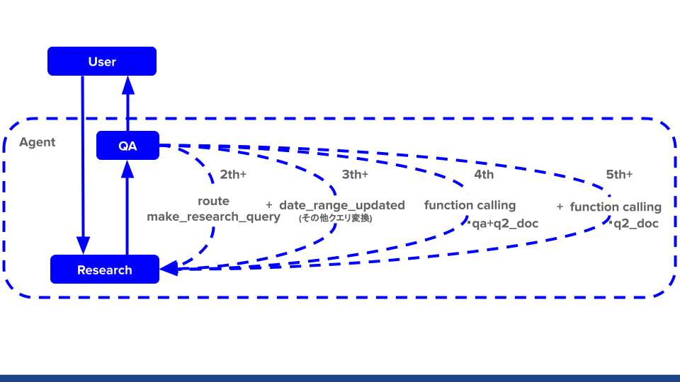

```python
!python3 -m pip install --upgrade pip
```

    Requirement already satisfied: pip in /usr/local/lib/python3.10/dist-packages (24.0)
    WARNING: Running pip as the 'root' user can result in broken permissions and conflicting behaviour with the system package manager. It is recommended to use a virtual environment instead: https://pip.pypa.io/warnings/venv
    


```python
!pip3 install arxiv==2.1.0
!pip3 install python-dotenv tiktoken
# !pip install openai==0.27.8
# !pip install openai==1.2.3
!pip install openai==1.3.4
!pip install -U duckduckgo-search==4.4
```

    Requirement already satisfied: arxiv==2.1.0 in /usr/local/lib/python3.10/dist-packages (2.1.0)
    Requirement already satisfied: feedparser==6.0.10 in /usr/local/lib/python3.10/dist-packages (from arxiv==2.1.0) (6.0.10)
    Requirement already satisfied: requests==2.31.0 in /usr/local/lib/python3.10/dist-packages (from arxiv==2.1.0) (2.31.0)
    Requirement already satisfied: sgmllib3k in /usr/local/lib/python3.10/dist-packages (from feedparser==6.0.10->arxiv==2.1.0) (1.0.0)
    Requirement already satisfied: charset-normalizer<4,>=2 in /usr/local/lib/python3.10/dist-packages (from requests==2.31.0->arxiv==2.1.0) (2.1.1)
    Requirement already satisfied: idna<4,>=2.5 in /usr/local/lib/python3.10/dist-packages (from requests==2.31.0->arxiv==2.1.0) (3.4)
    Requirement already satisfied: urllib3<3,>=1.21.1 in /usr/local/lib/python3.10/dist-packages (from requests==2.31.0->arxiv==2.1.0) (1.26.13)
    Requirement already satisfied: certifi>=2017.4.17 in /usr/local/lib/python3.10/dist-packages (from requests==2.31.0->arxiv==2.1.0) (2022.12.7)
    WARNING: Running pip as the 'root' user can result in broken permissions and conflicting behaviour with the system package manager. It is recommended to use a virtual environment instead: https://pip.pypa.io/warnings/venv
    Requirement already satisfied: python-dotenv in /usr/local/lib/python3.10/dist-packages (1.0.1)
    Requirement already satisfied: tiktoken in /usr/local/lib/python3.10/dist-packages (0.6.0)
    Requirement already satisfied: regex>=2022.1.18 in /usr/local/lib/python3.10/dist-packages (from tiktoken) (2023.12.25)
    Requirement already satisfied: requests>=2.26.0 in /usr/local/lib/python3.10/dist-packages (from tiktoken) (2.31.0)
    Requirement already satisfied: charset-normalizer<4,>=2 in /usr/local/lib/python3.10/dist-packages (from requests>=2.26.0->tiktoken) (2.1.1)
    Requirement already satisfied: idna<4,>=2.5 in /usr/local/lib/python3.10/dist-packages (from requests>=2.26.0->tiktoken) (3.4)
    Requirement already satisfied: urllib3<3,>=1.21.1 in /usr/local/lib/python3.10/dist-packages (from requests>=2.26.0->tiktoken) (1.26.13)
    Requirement already satisfied: certifi>=2017.4.17 in /usr/local/lib/python3.10/dist-packages (from requests>=2.26.0->tiktoken) (2022.12.7)
    WARNING: Running pip as the 'root' user can result in broken permissions and conflicting behaviour with the system package manager. It is recommended to use a virtual environment instead: https://pip.pypa.io/warnings/venv
    Requirement already satisfied: openai==1.3.4 in /usr/local/lib/python3.10/dist-packages (1.3.4)
    Requirement already satisfied: anyio<4,>=3.5.0 in /usr/local/lib/python3.10/dist-packages (from openai==1.3.4) (3.7.1)
    Requirement already satisfied: distro<2,>=1.7.0 in /usr/lib/python3/dist-packages (from openai==1.3.4) (1.7.0)
    Requirement already satisfied: httpx<1,>=0.23.0 in /usr/local/lib/python3.10/dist-packages (from openai==1.3.4) (0.26.0)
    Requirement already satisfied: pydantic<3,>=1.9.0 in /usr/local/lib/python3.10/dist-packages (from openai==1.3.4) (1.10.13)
    Requirement already satisfied: tqdm>4 in /usr/local/lib/python3.10/dist-packages (from openai==1.3.4) (4.66.1)
    Requirement already satisfied: typing-extensions<5,>=4.5 in /usr/local/lib/python3.10/dist-packages (from openai==1.3.4) (4.9.0)
    Requirement already satisfied: idna>=2.8 in /usr/local/lib/python3.10/dist-packages (from anyio<4,>=3.5.0->openai==1.3.4) (3.4)
    Requirement already satisfied: sniffio>=1.1 in /usr/local/lib/python3.10/dist-packages (from anyio<4,>=3.5.0->openai==1.3.4) (1.3.0)
    Requirement already satisfied: exceptiongroup in /usr/local/lib/python3.10/dist-packages (from anyio<4,>=3.5.0->openai==1.3.4) (1.2.0)
    Requirement already satisfied: certifi in /usr/local/lib/python3.10/dist-packages (from httpx<1,>=0.23.0->openai==1.3.4) (2022.12.7)
    Requirement already satisfied: httpcore==1.* in /usr/local/lib/python3.10/dist-packages (from httpx<1,>=0.23.0->openai==1.3.4) (1.0.3)
    Requirement already satisfied: h11<0.15,>=0.13 in /usr/local/lib/python3.10/dist-packages (from httpcore==1.*->httpx<1,>=0.23.0->openai==1.3.4) (0.14.0)
    WARNING: Running pip as the 'root' user can result in broken permissions and conflicting behaviour with the system package manager. It is recommended to use a virtual environment instead: https://pip.pypa.io/warnings/venv
    Requirement already satisfied: duckduckgo-search==4.4 in /usr/local/lib/python3.10/dist-packages (4.4)
    Requirement already satisfied: docstring-inheritance>=2.1.2 in /usr/local/lib/python3.10/dist-packages (from duckduckgo-search==4.4) (2.1.2)
    Requirement already satisfied: click>=8.1.7 in /usr/local/lib/python3.10/dist-packages (from duckduckgo-search==4.4) (8.1.7)
    Requirement already satisfied: curl-cffi>=0.6.0b7 in /usr/local/lib/python3.10/dist-packages (from duckduckgo-search==4.4) (0.6.0b9)
    Requirement already satisfied: lxml>=4.9.3 in /usr/local/lib/python3.10/dist-packages (from duckduckgo-search==4.4) (4.9.4)
    Requirement already satisfied: nest-asyncio>=1.6.0 in /usr/local/lib/python3.10/dist-packages (from duckduckgo-search==4.4) (1.6.0)
    Requirement already satisfied: cffi>=1.12.0 in /usr/local/lib/python3.10/dist-packages (from curl-cffi>=0.6.0b7->duckduckgo-search==4.4) (1.16.0)
    Requirement already satisfied: certifi in /usr/local/lib/python3.10/dist-packages (from curl-cffi>=0.6.0b7->duckduckgo-search==4.4) (2022.12.7)
    Requirement already satisfied: pycparser in /usr/local/lib/python3.10/dist-packages (from cffi>=1.12.0->curl-cffi>=0.6.0b7->duckduckgo-search==4.4) (2.21)
    WARNING: Running pip as the 'root' user can result in broken permissions and conflicting behaviour with the system package manager. It is recommended to use a virtual environment instead: https://pip.pypa.io/warnings/venv
    


```python
import os
import json
import datetime as dt
import yaml
import warnings


import arxiv
import openai
from openai import OpenAI
from dotenv import load_dotenv

from duckduckgo_search import DDGS, AsyncDDGS
import asyncio

# すべての警告を無視する
warnings.filterwarnings('ignore')
```


```python
from contextlib import contextmanager
from time import time

class Timer:
    """処理時間を表示するクラス
    with Timer(prefix=f'pred cv={i}'):
        y_pred_i = predict(model, loader=test_loader)
    
    with Timer(prefix='fit fold={} '.format(i)):
        clf.fit(x_train, y_train, 
                eval_set=[(x_valid, y_valid)],  
                early_stopping_rounds=100,
                verbose=verbose)

    with Timer(prefix='fit fold={} '.format(i), verbose=500):
        clf.fit(x_train, y_train, 
                eval_set=[(x_valid, y_valid)],  
                early_stopping_rounds=100,
                verbose=verbose)
    """
    def __init__(self, logger=None, format_str='{:.3f}[s]', prefix=None, suffix=None, sep=' ', verbose=0):

        if prefix: format_str = str(prefix) + sep + format_str
        if suffix: format_str = format_str + sep + str(suffix)
        self.format_str = format_str
        self.logger = logger
        self.start = None
        self.end = None
        self.verbose = verbose

    @property
    def duration(self):
        if self.end is None:
            return 0
        return self.end - self.start

    def __enter__(self):
        self.start = time()

    def __exit__(self, exc_type, exc_val, exc_tb):
        self.end = time()
        out_str = self.format_str.format(self.duration)
        if self.logger:
            self.logger.info(out_str)
        else:
            print(out_str)
```


```python
load_dotenv()
```


    True


```python
openai.api_key = os.getenv("OPENAI_API_KEY")
```


```python
MODEL_NAME = "gpt-3.5-turbo-0125"
# MODEL_NAME = "gpt-3.5-turbo-instruct"
# MODEL_NAME = "gpt-4-0125-preview"
TEMPERATURE = 0.7
# OpenAIクライアントの初期化
client = OpenAI()
```


```python
# 質問
# question = "禁闕の変について教えてください"

question = "今日の東京と稚内市の天気を教えてください"
```


```python
# 各ノードの名称を定義
RESEARCH_NODE = "research"
RE_RESEARCH_NODE = "re-research"
QUALITY_ASSURANCE_NODE = "quality_assurance"
WRITER_NODE = "writer"
SUPERVISOR_NODE = "supervisor"
```

## ノードの定義


```python
# チームメンバーの定義　特に使わないけど
"""
Researchノード: Web上から必要な情報を検索し、ユーザーからのリクエストに応じて記事を作成します。
Re-Researchノード: (QAでnot acceptだったら)問い合わせと直前の検索クエリから今まで使っていない検索クエリをを生成し、それを基にWeb上から必要な情報を検索し、ユーザーからのリクエストに応じて記事を作成します。
Quality Assurance (QA) ノード: 記事の品質が基準を満たしているかをチェックし、満たしていない場合はフィードバックを返します。品質の受け入れ基準は常にこのノードによって決定されます。
Writerノード: 世界最高レベルのAIチェッカーでも人間が書いたと判断されるような文章を作成します。
Supervisorノード: 会話を管理し、次に動作するワーカーを指示します。全てのタスクが完了したら、「FINISH」と応答します。
"""
team_members = [
    {"name": RESEARCH_NODE,
     "description": "Search the web for necessary information and write articles as requested by users."},
    {"name": RE_RESEARCH_NODE,
     "description": "Generate new search queries based on user inquiries and previous search queries that have not been used before, then search the web for necessary information to create articles as requested by users. Search the web for necessary information and write articles as requested by users."},
    {"name": QUALITY_ASSURANCE_NODE,
     "description": f"Check that the quality of the article meets the criteria. If not, return feedback. The acceptability of deliverables is always determined by {QUALITY_ASSURANCE_NODE}."},
    {"name": WRITER_NODE,
     "description": "Write articles that even the world's best AI checkers would judge as written by a human."},
]
```


```python
# エージェントに追加するシステムプロンプト作成関数
def create_agent_system(
        system_prompt: list,  # システムからエージェントへの初期プロンプト
        team_members: str,   # メンバーの役割
):
    # システムプロンプトに自律的な働きに関する指示を追加
    system_prompt.append({"role" : "system", "content" : "Work autonomously according to your specialty, using the tools available to you."})
    system_prompt.append({"role" : "system", "content" : " Do not ask for clarification."})
    system_prompt.append({"role" : "system", "content" : " Your other team members (and other teams) will collaborate with you with their own specialties."})
    system_prompt.append({"role" : "system", "content" : f" You are chosen for a reason! You are one of the following team members: {team_members}."})
    """
    あなたの専門分野に従って自律的に働いてください。使用可能なツールを使ってください
    確認のために質問をしないでください
    あなたの他のチームメンバーや他のチームも、それぞれの専門分野であなたと協力します
    あなたが選ばれたのには理由があります！あなたは以下のチームメンバーの一人です: {team_members}
    """
    # エージェントを実行するsystem_promptを返す
    return system_prompt
```


```python
# 使わないが
# チームのスーパーバイザーを生成する関数
def create_team_supervisor(
        model_name: str,
        system_prompt: list,
        members: list,  # チームメンバーのリスト
        job_result: str, # jobの結果
):
    # メンバー名のリストを生成
    member_names = [member["name"] for member in members]
    team_members = []
    # チームメンバーの名前と説明を文字列に整形
    for member in members:
        team_members.append(f"\n name: {member['name']}\n description: {member['description']}")
    options = ["FINISH"] + member_names  # 終了オプション
    
    # スーパーバイザー用のプロンプトテンプレートを作成
    superviser_prompt = []
    superviser_prompt.append({"role" : "system", "content" : "Given the conversation above, who should act next?"})
    superviser_prompt.append({"role" : "system", "content" : f" Or should we FINISH? Select one of option: {options}"})
    # team_membersからcontent文字列を作成
    content = 'List one of the choices as "name" and its description as "description" below.'
    # チームメンバーの名前と説明を文字列に整形
    for member in team_members:
        content += f"\n name: {member['name']}\n description: {member['description']}"
        superviser_prompt.append({"role" : "system", "content" : f"{content}"})
    superviser_prompt.append({"role": "user", "content": 'Please generate JSON from the text of job results. Use "supervisor_result" as the schema, and use one of {options} as the key to generate it in the form {"supervisor_result": {option}}.'})
    superviser_prompt.append({"role": "user", "content": f"Text of job results: {job_result}"})
    """
    システム
    上記の会話を踏まえて、次に行動すべきは誰ですか？
    選ぶ選択肢の一つを"name"として、その説明を"description"として以下に記載します。\n name: {member['name']}\n description: {member['description']}\n
    それとも、終了すべきですか？次の選択肢の中から一つ選んでください: {options}
    
    user
    次のジョブ結果のテキストからJSONを生成してください。「supervisor_result」をスキーマとして使用し、{options}のうちの一つをキーとして使って、形式が{"supervisor_result": {option}}となるように生成してください。
    ジョブ結果のテキスト: {job_result}
    """
    # スーパーバイザー用のプロンプトテンプレートを作成
    response = client.chat.completions.create(
        model=model_name, # model = "deployment_name".
        messages=superviser_prompt,
        response_format={ "type": "json_object" },
        temperature=TEMPERATURE,
    )
    # print(response.choices[0].message.content)
    
    # スーパーバイザーの機能をバインドし、JSON出力を解析するパイプラインを作成
    return response.choices[0].message.content
```

## Researchエージェントの定義


```python
# テキスト検索用の関数
def search_text(keywords, region='wt-wt', safesearch='moderate', timelimit=None, max_results=10):
    with DDGS() as ddgs:
        results = [r for r in ddgs.text(keywords, region=region, safesearch=safesearch, timelimit=timelimit, max_results=max_results)]
    return results

# 画像検索用の関数
def search_images(keywords, region='wt-wt', safesearch='moderate', size=None, color=None, max_results=10):
    with DDGS() as ddgs:
        results = [r for r in ddgs.images(keywords, region=region, safesearch=safesearch, size=size, color=color, max_results=max_results)]
    return results

# 非同期テキスト検索用の関数
def async_search_text(keywords, max_results=10):
    with AsyncDDGS() as ddgs:
        results = [r for r in ddgs.text(keywords, max_results=max_results)]
    return results


# # 使用例: テキスト検索
# text_results = search_text(question)
# for result in text_results:
#     print(result)

# # 使用例: 画像検索
# image_results = search_images('cats', color='Monochrome', max_results=5)
# for result in image_results:
#     print(result)
```


```python

```


```python
# Researchノードの定義
def research_node(
        model_name: str,
        job_result: str, # search の結果
):
    # リサーチエージェントを呼び出し、結果を取得
    # あなたは、DuckDuckGo検索エンジンを使って、検索された情報を順番に確認し、ポイントを外さずに思慮深く説明するリサーチアシスタントです。
    prompt = [{'role': 'system', 'content': "You are a research assistant who uses the DuckDuckGo search engine to review searched information in order, explaining points carefully without missing anything."}]
    prompt.append({"role": "system", "content": "Explanation results must be in Japanese."})
    
    research_prompt = create_agent_system(prompt, RESEARCH_NODE)
    research_prompt.append({"role": "system", "content": "Please generate a JSON from the text of the following search results. Use 'explanation_result' as the schema and 'explanation results' as the key, and generate it in the format of {'explanation_result': 'explanation results'}."})
    research_prompt.append({"role": "user", "content": "Generate a JSON from the text of the following search results. Use 'explanation_result' as the schema and the results of explaining the search as the key, creating it in the format of {'explanation_result': the results of explaining the search}."})
    research_prompt.append({"role": "user", "content": f"Text of search job results: {job_result}"})
    """
    システム
    あなたは、DuckDuckGo検索エンジンを使って、検索された情報を順番に確認し、ポイントを外さずに思慮深く説明するリサーチアシスタントです。
    説明結果は日本語でなければならない。
    
    あなたの専門分野に従って自律的に働いてください。使用可能なツールを使ってください
    確認のために質問をしないでください
    あなたの他のチームメンバーや他のチームも、それぞれの専門分野であなたと協力します
    あなたが選ばれたのには理由があります！あなたは以下のチームメンバーの一人です: {team_members}
    
    以下の検索結果のテキストからJSONを生成してください。スキーマとして「explanation_result」、キーとして「explanation results」を使用し、{"explanation_result": explanation results}の形式で生成してください。
    user
    以下の検索結果のテキストからJSONを生成する。スキーマとして "explanation_result "を使用し、キーとして検索を説明した結果を使用して、{"explanation_result": 検索を説明した結果}というフォーマットで生成します。
    search ジョブ結果のテキスト: {job_result}
    """
    
    # Research用のプロンプトテンプレートを作成
    response = client.chat.completions.create(
        model=model_name, # model = "deployment_name".
        messages=research_prompt,
        response_format={ "type": "json_object" },
        temperature=TEMPERATURE,
    )
    search_res_str = response.choices[0].message.content
    # print(search_res_str)
    
    # JSON形式の文字列を辞書に変換
    search_res = json.loads(search_res_str)
    
    # 出力と新しいメッセージをステートに反映
    return {
        "output": search_res["explanation_result"],
        "messages": job_result
    }
```


```python
# 再検索用クエリを抽出
def make_re_search_query(
    model_name: str,
    question: str,    # 最初の質問
    before_query: str,   # 直前の検索クエリ 初回は question
):
    
    # questionから検索クエリを作成する。before_queryと違うものクエリを作成する
    # テキストのブロックが提供されます。あなたのタスクは、そこからキーワードのリストを抽出することです。
    prompt = [{'role': 'system', 'content': "You will be provided with a block of text, and your task is to extract a list of keywords from it."}]
    
    prompt.append({"role": "system", "content": "Use the following example to extract a list of keywords.\n###Example###\n\nuser's question: Black-on-black ware is a 20th- and 21st-century pottery tradition developed by the Puebloan Native American ceramic artists in Northern New Mexico. Traditional reduction-fired blackware has been made for centuries by pueblo artists. Black-on-black ware of the past century is produced with a smooth surface, with the designs applied through selective burnishing or the application of refractory slip. Another style involves carving or incising designs and selectively polishing the raised areas. For generations several families from Kha'po Owingeh and P'ohwhóge Owingeh pueblos have been making black-on-black ware with the techniques passed down from matriarch potters. Artists from other pueblos have also produced black-on-black ware. Several contemporary artists have created works honoring the pottery of their ancestors.\n\nresult query: {      'query_result': 'Black-on-black ware, pottery tradition, Puebloan Native American, ceramic artists, Northern New Mexico, reduction-fired blackware, pueblo artists, smooth surface, designs, selective burnishing, refractory slip, carving, incising designs, polishing, generations, families, Kha'po Owingeh, P'ohwhóge Owingeh pueblos, matriarch potters, contemporary artists, ancestors'}"})
    """
    Use the following example to extract a list of keywords.
    ###Example###
    
    user's question: Black-on-black ware is a 20th- and 21st-century pottery tradition developed by the Puebloan Native American ceramic artists in Northern New Mexico. Traditional reduction-fired blackware has been made for centuries by pueblo artists. Black-on-black ware of the past century is produced with a smooth surface, with the designs applied through selective burnishing or the application of refractory slip. Another style involves carving or incising designs and selectively polishing the raised areas. For generations several families from Kha'po Owingeh and P'ohwhóge Owingeh pueblos have been making black-on-black ware with the techniques passed down from matriarch potters. Artists from other pueblos have also produced black-on-black ware. Several contemporary artists have created works honoring the pottery of their ancestors.
    
    result query: 
    {
      "query_result": "Black-on-black ware, pottery tradition, Puebloan Native American, ceramic artists, Northern New Mexico, reduction-fired blackware, pueblo artists, smooth surface, designs, selective burnishing, refractory slip, carving, incising designs, polishing, generations, families, Kha'po Owingeh, P'ohwhóge Owingeh pueblos, matriarch potters, contemporary artists, ancestors"
    }
    """
    prompt.append({'role': 'system', 'content': "Generate queries that are as different as possible from the query used in the previous search for extracting the list of keywords."})
    prompt.append({'role': 'system', 'content': f"The query used in the previous search was '{before_query}'."})

    prompt.append({"role": "user", "content": "Generate JSON from search result text. Use 'query_result' as the schema, generate in the format {'query_result': Result extract keywords from a block of text.}, and key in the evaluation results, such as whether the generated search results describe the user's request."})
    prompt.append({"role": "user", "content": f"user's question:{question}. Result extract keywords from a block of text.:"})
    

    """
    system
    以下の例を参考にキーワードのリストを抽出してください。
    
    ###Example###
    
    user's question: 黒地に黒の陶器は、ニューメキシコ州北部のプエブロ人ネイティブ アメリカンの陶芸家によって発展した、20 世紀から 21 世紀にかけての陶器の伝統です。伝統的な還元焼成黒食器は、プエブロの芸術家によって何世紀にもわたって作られてきました。前世紀の黒地に黒の陶器は、選択的に磨きをかけたり、耐火物スリップを塗布したりすることによってデザインが施され、滑らかな表面で製造されています。別のスタイルには、デザインを彫刻または切り込み、盛り上がった領域を選択的に研磨することが含まれます。カポ オウィンゲとポホゲ オウィンゲ プエブロの数家族が、家長の陶芸家から受け継がれた技術を用いて、黒地に黒の陶器を何世代にもわたって作り続けてきました。他のプエブロ出身の芸術家も黒地に黒の陶器を制作しています。何人かの現代芸術家は、祖先の陶器に敬意を表して作品を制作しました。
    
    result query: 
    {
      'query_result': '黒地に黒の器、陶器の伝統、プエブロのネイティブ アメリカン、陶芸家、ニューメキシコ北部、還元焼成黒器、プエブロの芸術家、滑らかな表面、デザイン、選択的バニシング、耐火物スリップ、彫刻、切り込みデザイン、研磨、世代、家族、カポ・オウィンゲ、ポホゲ・オウィンゲ・プエブロス、女家長陶芸家、現代芸術家、先祖'
    }
    
    キーワードリストを抽出するために、前回の検索で使用したクエリとはできるだけ異なるクエリを生成する。
    前回の検索で使用したクエリは「{before_query}」です。
    user
    検索結果のテキストからJSONを生成する。スキーマとして "query_result"を使用し、{"query_result"： テキストブロックからキーワードを抽出した結果}の形式で生成する。
    
    前回の検索で使用したクエリ: "{before_query}".

    
    user's question:{}. result query:
    """
    
    # Research用のプロンプトテンプレートを作成
    response = client.chat.completions.create(
        model=model_name, # model = "deployment_name".
        messages=prompt,
        response_format={ "type": "json_object" },
        temperature=TEMPERATURE+TEMPERATURE,
    )
    res_str = response.choices[0].message.content
    # print(res_str)
    
    # JSON形式の文字列を辞書に変換
    res = json.loads(res_str)
    
    # 出力と新しいメッセージをステートに反映
    return {
        "output": res["query_result"],
        "before_query": before_query
    }
```


```python
# test_query = make_re_search_query(
#     MODEL_NAME,
#     question,
#     question
# )
# test_query['output']
```


```python
# Re-Researchノードの定義
# ###Instruction###で始め、次に関連する場合は###Example###または'###Question###
def re_research_node(
    model_name: str,
    question: str,    # 最初の質問
    before_query: str,   # 直前の検索クエリ 初回は question
    before_job_result: str, # 直前のsearch の結果
):
    # re-search 用クエリ
    re_query = make_re_search_query(
        MODEL_NAME,
        question,
        before_query
    )
    re_query = re_query['output']
    
    # search
    re_search = ""
    text_results = search_text(re_query)
    for result in text_results:
        re_search += result["body"] + ", "
        print(re_search["body"])
    
    # search_node
    research_res = research_node(
        MODEL_NAME,
        search, # search の結果
    )
    research_res['output']
    
    # 出力と新しいメッセージをステートに反映
    return {
        "output": research_res['output'],
        "re_query": re_query
    }
```


```python
# 品質チェックノードの定義
def qa_node(
    model_name: str,
    question:str, # 検索結果
    research_output:str, # 検索結果
):
    # 品質チェックの指示を含むシステムメッセージ
#     system_message = """You are a specialist in inspecting the quality of articles. 
#     Inspect the article to see if it meets the following requirements:

#     - The article is written in Japanese.
#     - The writing style MUST be such that the AI sentence checker determines that it was written by a HUMAN.
#     - The article MUST be written in a way that is easy to understand.
#     - The article MUST meet the user's requirements.

#     If the evaluation criteria are met, write 'Acceptable'.
#     In addition, write the reason why you judged that the evaluation criteria are met.

#     If the evaluation criteria are not met, write 'Not Acceptable'.
#     In addition, provide feedback on what needs to be done to meet the evaluation criteria.

#     DO NOT make excuses such as 'I can't make a decision because I am an AI'.

#     The quality of your articles is relevant to your career.
#     Please be as rigorous as possible in your inspections and make sure that your feedback is helpful in making corrections.
#     """
    prompt = [{'role': 'system', 'content': "You are a specialist in inspecting the quality of articles. Inspect the article to see if it meets the following requirements: The article is written in Japanese."}]
    prompt.append({'role': 'system', 'content': "You are a specialist in inspecting the quality of articles. Inspect the article to see if it meets the following requirements: The writing style MUST be such that the AI sentence checker determines that it was written by a HUMAN."})
    prompt.append({'role': 'system', 'content': "You are a specialist in inspecting the quality of articles. Inspect the article to see if it meets the following requirements: The article MUST be written in a way that is easy to understand."})
    prompt.append({'role': 'system', 'content': "You are a specialist in inspecting the quality of articles. Inspect the article to see if it meets the following requirements: The article MUST meet the user's requirements."})

    prompt.append({'role': 'system', 'content': "You are a specialist in inspecting the quality of articles. Inspect the article to see if it meets the following requirements: If the evaluation criteria are met, write 'Acceptable'."})
    prompt.append({'role': 'system', 'content': "You are a specialist in inspecting the quality of articles. Inspect the article to see if it meets the following requirements: In addition, write the reason why you judged that the evaluation criteria are met."})
  
    prompt.append({'role': 'system', 'content': "You are a specialist in inspecting the quality of articles. Inspect the article to see if it meets the following requirements: If the evaluation criteria are not met, write 'Not Acceptable'."})
    prompt.append({'role': 'system', 'content': "You are a specialist in inspecting the quality of articles. Inspect the article to see if it meets the following requirements: In addition, provide feedback on what needs to be done to meet the evaluation criteria."})

    prompt.append({'role': 'system', 'content': "You are a specialist in inspecting the quality of articles. Inspect the article to see if it meets the following requirements: DO NOT make excuses such as 'I can't make a decision because I am an AI'."})
  
    prompt.append({'role': 'system', 'content': "You are a specialist in inspecting the quality of articles. Inspect the article to see if it meets the following requirements: The quality of your articles is relevant to your career."})
    prompt.append({'role': 'system', 'content': "You are a specialist in inspecting the quality of articles. Inspect the article to see if it meets the following requirements: Please be as rigorous as possible in your inspections and make sure that your feedback is helpful in making corrections."})

    # prompt = [{'role': 'system', 'content': system_message}]
    qa_prompt = create_agent_system(prompt, QUALITY_ASSURANCE_NODE)
    qa_prompt.append({"role": "user", "content": "Generate JSON from search result text. Use 'qa_result' as the schema, generate in the format {'qa_result': Acceptable or Not Acceptable}, and key in the evaluation results, such as whether the generated search results describe the user's request."})
    qa_prompt.append({"role": "user", "content": f"user's requirements:{question}. search result text: {research_output}"})
    
    """
    評価基準の適用例:
    1. 言語と文章スタイルの評価:
        - 記事が日本語で書かれているか。
        - 文章が人間によって書かれたとAI文章チェッカーに判断させるスタイルであるか。
    2. 内容の理解しやすさ:
        - 記事の内容が簡潔に、かつ明確に表現されているか。
        - 専門用語が適切に説明され、一般の読者も理解できるようになっているか。
    3. ユーザーの要件への適合性:
        - 記事がユーザーの要求や指定したテーマに沿っているか。
        - ユーザーが期待する情報や視点が適切に取り入れられているか。
    評価例:
    - 受理可能: 記事は全ての評価基準を満たしています。日本語で書かれており、文章スタイルは人間によるものと判断できます。
    内容は理解しやすく、ユーザーの要件にも適合しています。これらの点から、記事は受理可能と判断します。
    - 受理不可: 記事は一部の評価基準を満たしていません。特に、文章スタイルがAIによって書かれたように見える部分があります。
    また、専門用語の説明が不足しているため、内容の理解が難しい箇所があります。これらの問題を解決するためには、人間らしい表現を増やし、専門用語に対する説明を追加する必要があります。
    user
    検索結果のテキストからJSONを生成する。スキーマとして "qa_result"を使用し、{"qa_result"： Acceptable or Not Acceptable}の形式で生成し、生成された検索結果をキーとして評価する。
    user's requirements:{}. 検索結果のテキスト: {research_output}
    """
    
    # Research用のプロンプトテンプレートを作成
    response = client.chat.completions.create(
        model=model_name, # model = "deployment_name".
        messages=qa_prompt,
        response_format={ "type": "json_object" },
        temperature=TEMPERATURE,
    )
    qa_res_str = response.choices[0].message.content
    # print(qa_res_str)
    
    # JSON形式の文字列を辞書に変換
    qa_res = json.loads(qa_res_str)
    """
    "qa_result": "Not Acceptable" だったら戻り値に次の検索ワードを入れるか、質問と分割するかとかしたい
    """
    # 出力と新しいメッセージをステートに反映
    return {
        "output": qa_res["qa_result"]
    }
```


```python

```


```python
# # 使用例: 1サイクル
# with Timer(prefix=f'Processing time for one cycle.'):
#     question = "今日の東京と稚内市の天気を教えてください"

#     search = ""
#     text_results = search_text(question)
#     for result in text_results:
#         search += result["body"] + ", "
#         # print(result["body"])

#     # search_node
#     research_res = research_node(
#         MODEL_NAME,
#         search, # search の結果
#     )
#     research_output = research_res['output']
#     print(f"検索して質問に回答した結果: {research_output}")

#     qa_res = qa_node(
#         MODEL_NAME,
#         question,
#         research_output
#     )
#     print(f"質問と回答の整合性チェック: {qa_res}")

```

検索して質問に回答した結果: 稚内市の天気予報に関する情報が提供されており、今日・明日の天気や気温、降水確率、注意報などが記載されている。また、稚内市のPM2.5分布予測や地震情報、スキー積雪情報なども含まれている。

質問と回答の整合性チェック: {'output': 'Not Acceptable'}

Processing time for one cycle. 5.816[s]


```python
def search_agent_1cycle(
    question: str,
    query: str,
):
    search = ""
    text_results = search_text(query)
    for result in text_results:
        search += result["body"] + ", "
        # print(result["body"])

    # search_node
    research_res = research_node(
        MODEL_NAME,
        search, # search の結果
    )
    research_output = research_res['output']

    qa_res = qa_node(
        MODEL_NAME,
        question,
        research_output
    )
    
    
    return {
        "output": research_output,
        "qa_result": qa_res
    }
```


```python
def date_range_from_word_updated_fixed(word):
    # 現在の日時を取得
    now = dt.datetime.now()
    # 日付の範囲を格納する変数を初期化
    date_range = ""
    
    if "最近" in word:
        six_months_ago = now - dt.timedelta(days=182) # 大体半年前
        date_range = f"{six_months_ago.strftime('%Y-%m-%d')}から{now.strftime('%Y-%m-%d')}までの{word.replace('最近', '')}"
    
    elif "今年" in word:
        start_of_year = dt.datetime(now.year, 1, 1)
        end_of_year = dt.datetime(now.year, 12, 31)
        date_range = f"{start_of_year.strftime('%Y-%m-%d')}から{end_of_year.strftime('%Y-%m-%d')}までの{word.replace('今年', '')}"
    
    elif "今週" in word:
        start_of_week = now - dt.timedelta(days=now.weekday())
        end_of_week = start_of_week + dt.timedelta(days=6)
        date_range = f"{start_of_week.strftime('%Y-%m-%d')}から{end_of_week.strftime('%Y-%m-%d')}までの{word.replace('今週', '')}"
    
    elif "来週" in word:
        start_of_next_week = now + dt.timedelta(days=(7 - now.weekday()))
        end_of_next_week = start_of_next_week + dt.timedelta(days=6)
        date_range = f"{start_of_next_week.strftime('%Y-%m-%d')}から{end_of_next_week.strftime('%Y-%m-%d')}までの{word.replace('来週', '')}"
    
    elif "昨日" in word:
        yesterday = now - dt.timedelta(days=1)
        date_range = yesterday.strftime('%Y-%m-%d')
    
    elif "未来" in word:
        start_of_next_year = dt.datetime(now.year + 1, 1, 1)
        end_of_next_year = dt.datetime(now.year + 1, 12, 31)
        date_range = f"{now.strftime('%Y-%m-%d')}から{start_of_next_year.strftime('%Y-%m-%d')}までの{word.replace('未来', '')}"
        # future_time = word.replace("未来", "").strip()
        # if future_time == "":
        #     start_of_next_year = dt.datetime(now.year + 1, 1, 1)
        #     end_of_next_year = dt.datetime(now.year + 1, 12, 31)
        #     date_range = f"{now.strftime('%Y-%m-%d')}から{start_of_next_year.strftime('%Y-%m-%d')}までの{word.replace('未来', '')}"
        # elif future_time.isdigit():
        #     future_date = now + dt.timedelta(days=365 * int(future_time))
        #     date_range = future_date.strftime('%Y-%m-%d')
        # else:
        #     # 不正確な入力に対する処理を追加するか、エラーメッセージを表示する
        #     return word
    elif "これから" in word:
        start_of_next_year = dt.datetime(now.year + 1, 1, 1)
        end_of_next_year = dt.datetime(now.year + 1, 12, 31)
        date_range = f"{now.strftime('%Y-%m-%d')}から{start_of_next_year.strftime('%Y-%m-%d')}までの{word.replace('これから', '')}"
        # future_time = word.replace("これから", "").strip()
        # if future_time == "":
        #     start_of_next_year = dt.datetime(now.year + 1, 1, 1)
        #     end_of_next_year = dt.datetime(now.year + 1, 12, 31)
        #     date_range = f"{now.strftime('%Y-%m-%d')}から{start_of_next_year.strftime('%Y-%m-%d')}までの{word.replace('これから', '')}"
        # elif future_time.isdigit():
        #     future_date = now + dt.timedelta(days=365 * int(future_time))
        #     date_range = future_date.strftime('%Y-%m-%d')
        # else:
        #     # 不正確な入力に対する処理を追加するか、エラーメッセージを表示する
        #     return word
    elif "将来" in word:
        start_of_next_year = dt.datetime(now.year + 1, 1, 1)
        end_of_next_year = dt.datetime(now.year + 1, 12, 31)
        date_range = f"{now.strftime('%Y-%m-%d')}から{start_of_next_year.strftime('%Y-%m-%d')}までの{word.replace('将来', '')}"
        
    elif "最新" in word:
        # 「最新の」処理
        six_months_ago = now - dt.timedelta(days=182) # 大体半年前
        date_range = f"{six_months_ago.strftime('%Y-%m-%d')}から{now.strftime('%Y-%m-%d')}までの{word.replace('最新', '')}"
    

    elif "近年" in word:
        # 「近年の」処理
        three_years_ago = now - dt.timedelta(days=3*365) # おおよそ3年前
        date_range = f"{three_years_ago.strftime('%Y-%m-%d')}から{now.strftime('%Y-%m-%d')}までの{word.replace('近年', '')}"

    else:
        # 日付のわかるワードがない場合はそのまま返す
        return word
    
    return date_range

```


```python
# # テスト
# print(date_range_from_word_updated_fixed("最近"))
# print(date_range_from_word_updated_fixed("今年"))
# print(date_range_from_word_updated_fixed("今週"))
# print(date_range_from_word_updated_fixed("来週"))
# print(date_range_from_word_updated_fixed("昨日"))
# print(date_range_from_word_updated_fixed("未来"))
# print(date_range_from_word_updated_fixed("未来50年後"))
# print(date_range_from_word_updated_fixed("未来5日後"))
# print(date_range_from_word_updated_fixed("最新のAIトレンド"))
# print(date_range_from_word_updated_fixed("今年のファッショントレンド"))
```

検索クエリを具体化する道具


```python
functions = \
[
    {
        # 【Query2doc】
        # 関数名
        "name": "q2_doc",
        # 関数の説明
        "description": "与えられた専門的な単語や難しい文章をわかりやすく詳細に説明します。",
        # 関数の引数の定義
        "parameters":
         {
            "type": "object",
            "properties":
             {
                "model_name":
                {
                    "type": "string",
                    "description": "わかりやすく詳細に説明するために使うモデル名"
                },
                "query":
                {
                    "type": "string",
                    "description": "専門的な単語や難しい文章が入ります。"
                },
            },
            "required": ["model_name", "query"],
        }
    },
]

```


```python
# Query2doc
def q2_doc(
    model_name: str,
    query: str,
):
    
    # queryの詳細説明を作成する。
    # あなたは、以下の例を参考にクエリを順番に詳しく日本語で説明し無ければいけません。
    prompt = [{'role': 'system', 'content': "You must explain queries in detail and in order in Japanese, referring to the examples below."}]
    
    prompt.append({"role": "system", "content": "Use the following example to create a detailed query description.\n\n###Example###\n\nQuery: what state is this zip code 85282\n\nresult query: {      'q2_doc_passage': 'Welcome to TEMPE, AZ 85282. 85282 is a rural zip code in Tempe, Arizona. The population is primarily white, and mostly single. At $200,200 the average home value here is a bit higher than average for the Phoenix-Mesa-Scottsdale metro area, so this probably isn’t the place to look for housing bargains.5282 Zip code is located in the Mountain time zone at 33 degrees latitude (Fun Fact: this is the same latitude as Damascus, Syria!) and -112 degrees longitude.'}"})
    """
    Use the following example to create a detailed query description.
    
    ###Example###
    Query: what state is this zip code 85282
    
    result query: 
    {
      "q2_doc_passage": "Welcome to TEMPE, AZ 85282. 85282 is a rural zip code in Tempe, Arizona. The population is primarily white, and mostly single. At $200,200 the average home value here is a bit higher than average for the Phoenix-Mesa-Scottsdale metro area, so this probably isn’t the place to look for housing bargains.5282 Zip code is located in the Mountain time zone at 33 degrees latitude (Fun Fact: this is the same latitude as Damascus, Syria!) and -112 degrees longitude."
    }
    """
    prompt.append({"role": "system", "content": "Use the following example to create a detailed query description.\n\n###Example###\n\nQuery: why is gibbs model of reflection good\n\nresult query: {      'q2_doc_passage': 'In this reflection, I am going to use Gibbs (1988) Reflective Cycle. This model is a recognised framework for my reflection. Gibbs (1988) consists of six stages to complete one cycle which is able to improve my nursing practice continuously and learning from the experience for better practice in the future.n conclusion of my reflective assignment, I mention the model that I chose, Gibbs (1988) Reflective Cycle as my framework of my reflective. I state the reasons why I am choosing the model as well as some discussion on the important of doing reflection in nursing practice.'}"})
    """
    Use the following example to create a detailed query description.
    
    ###Example###
    Query: why is gibbs model of reflection good
    
    result query: 
    {
      "q2_doc_passage": "In this reflection, I am going to use Gibbs (1988) Reflective Cycle. This model is a recognised framework for my reflection. Gibbs (1988) consists of six stages to complete one cycle which is able to improve my nursing practice continuously and learning from the experience for better practice in the future.n conclusion of my reflective assignment, I mention the model that I chose, Gibbs (1988) Reflective Cycle as my framework of my reflective. I state the reasons why I am choosing the model as well as some discussion on the important of doing reflection in nursing practice."
    }
    """
    prompt.append({"role": "system", "content": "Use the following example to create a detailed query description.\n\n###Example###\n\nQuery: what does a thousand pardons means\n\nresult query: {      'q2_doc_passage': 'Oh, that’s all right, that’s all right, give us a rest; never mind about the direction, hang the direction - I beg pardon, I beg a thousand pardons, I am not well to-day; pay no attention when I soliloquize, it is an old habit, an old, bad habit, and hard to get rid of when one’s digestion is all disordered with eating food that was raised forever and ever before he was born; good land! a man can’t keep his functions regular on spring chickens thirteen hundred years old.'}"})    
    """
    Use the following example to create a detailed query description.
    
    ###Example###
    Query: what does a thousand pardons means
    
    result query: 
    {
      "q2_doc_passage": "Oh, that’s all right, that’s all right, give us a rest; never mind about the direction, hang the direction - I beg pardon, I beg a thousand pardons, I am not well to-day; pay no attention when I soliloquize, it is an old habit, an old, bad habit, and hard to get rid of when one’s digestion is all disordered with eating food that was raised forever and ever before he was born; good land! a man can’t keep his functions regular on spring chickens thirteen hundred years old."
    }
    """
    prompt.append({"role": "system", "content": "Use the following example to create a detailed query description.\n\n###Example###\n\nQuery: what is a macro warning\n\nresult query: {      'q2_doc_passage': 'Macro virus warning appears when no macros exist in the file in Word. When you open a Microsoft Word 2002 document or template, you may receive the following macro virus warning, even though the document or template does not contain macros: C:\<path>\<file name>contains macros. Macros may contain viruses.'}"})
    """
    Use the following example to create a detailed query description.
    
    ###Example###
    Query: what is a macro warning   
    
    result query: 
    {
      "q2_doc_passage": "Macro virus warning appears when no macros exist in the file in Word. When you open a Microsoft Word 2002 document or template, you may receive the following macro virus warning, even though the document or template does not contain macros: C:\<path>\<file name>contains macros. Macros may contain viruses."
    }
    """
    prompt.append({"role": "system", "content": "Use the following example to create a detailed query description.\n\n###Example###\n\nQuery: ポケモン緑はいつリリースされたか\n\nresult query: {      'q2_doc_passage': 'ポケモン緑は1996年2月27日に日本でリリースされました。これはポケモンシリーズのゲームの中で最初のものであり、後に1998年にアメリカでリリースされたポケモン赤と青の基礎となりました。オリジナルのポケモン緑は、シリーズのファンの間で愛されるクラシックな作品として残っています。'}"})
    """
    Use the following example to create a detailed query description.
    
    ###Example###
    Query: ポケモン緑はいつリリースされたか 
    
    result query: 
    {
      "q2_doc_passage": "ポケモン緑は1996年2月27日に日本でリリースされました。これはポケモンシリーズのゲームの中で最初のものであり、後に1998年にアメリカでリリースされたポケモン赤と青の基礎となりました。オリジナルのポケモン緑は、シリーズのファンの間で愛されるクラシックな作品として残っています。"
    }
    """
    

    prompt.append({"role": "user", "content": "Generate JSON from the text of a detailed query description. Use 'q2_doc_passage' as the schema and generate it in the form {'q2_doc_passage': text of the detailed query description}."})
    prompt.append({"role": "user", "content": f"Query:{query}. Result extract keywords from a block of text.:"})
    

    """
    system
    あなたは、以下の例を参考にクエリを順番に詳しく日本語で説明し無ければいけません。
    次の例を使用して、詳細なクエリの説明を作成します。
    
    ###Example###
    
    Write a passage that answers the given query: 使用された完全なプロンプトの翻訳
    問い: この郵便番号85282はどの州にあるか
    回答: TEMPE, AZ 85282へようこそ。85282はアリゾナ州テンピにある郵便番号です。人口は主に白人で、ほとんどが独身です。平均住宅価格は$200,200で、フェニックス-メサ-スコッツデール都市圏の平均よりも少し高いため、住宅の掘り出し物を探す場所ではないかもしれません。85282郵便番号は、山岳時間帯の33度緯度（面白い事実: これはシリアのダマスカスと同じ緯度です！）と-112度経度に位置しています。
    問い: ギブスの反省モデルが良い理由は何か
    回答: この反省では、ギブス（1988年）の反射サイクルを使用します。このモデルは、私の反省のための認識された枠組みです。ギブス（1988年）は、一連のサイクルを完了するために6つの段階からなり、経験から学び、将来の実践に向けて看護実践を継続的に改善することができます。私の反省課題の結論として、選んだモデルであるギブス（1988年）の反射サイクルと、そのモデルを選んだ理由、さらに看護実践における反省の重要性についての議論を述べます。
    問い: 千回の許しとは何を意味するか
    回答: それは大丈夫、それは大丈夫、休息を与えてください; 方向について心配するな、方向を吊るして - 申し訳ありません、千回の許しを請います、私は今日は体調が優れません; 私が独り言を言うときに注意を払わないでください、それは古い習慣、古くからの悪い習慣で、一人の消化が生まれる前から永遠に育てられた食物で全て乱れているとき、それを断つのは難しいです; いいですね！ 1300年前の春の鶏で人の機能を規則正しく保つことはできません。
    問い: マクロ警告とは何か
    回答: ファイルにマクロが存在しない場合にマクロウイルス警告が表示されます。Microsoft Word 2002のドキュメントやテンプレートを開くと、ドキュメントやテンプレートにマクロが含まれていないにも関わらず、次のようなマクロウイルス警告が表示されることがあります: C:<パス><ファイル名>にはマクロが含まれています。マクロにはウイルスが含まれている可能性があります。
    問い: ポケモン緑はいつリリースされたか
    回答: ポケモン緑は1996年2月27日に日本でリリースされました。これはポケモンシリーズのゲームの中で最初のものであり、後に1998年にアメリカでリリースされたポケモン赤と青の基礎となりました。オリジナルのポケモン緑は、シリーズのファンの間で愛されるクラシックな作品として残っています。
    
    キーワードリストを抽出するために、前回の検索で使用したクエリとはできるだけ異なるクエリを生成する。
    user
    詳細なクエリの説明のテキストからJSONを生成する。スキーマとして "q2_doc_passage"を使用し、{"q2_doc_passage"： 詳細なクエリの説明のテキスト}の形式で生成する。
    
    Query:{}. q2_doc_passage:
    """
    
    # Research用のプロンプトテンプレートを作成
    response = client.chat.completions.create(
        model=model_name, # model = "deployment_name".
        messages=prompt,
        response_format={ "type": "json_object" },
        temperature=TEMPERATURE+TEMPERATURE,
    )
    res_str = response.choices[0].message.content
    # print(res_str)
    
    # JSON形式の文字列を辞書に変換
    res = json.loads(res_str)
    
    # 出力と新しいメッセージをステートに反映
    return {
        "output": res["q2_doc_passage"],
        "use_query": query
    }
```


```python

```


```python
# 関数を選択して実行するデモ関数
def function_calling_query_change_3cycle(
    question: str,
    query: str,
):

    # GPTにプロンプトと関数定義リストを一緒に投入し、Function callingの使用を指示
    response = client.chat.completions.create(
        model=MODEL_NAME,
        temperature=TEMPERATURE,
        messages=
    	[
    		{ "role": "user", "content": query}  # プロンプトを投入
    	],
        functions=functions, # プロンプトと一緒に関数定義リストを投入
        function_call="auto", # Function callingを使用するが、その際、関数の選択はGPTに任せる
    )

    # GPTからの応答を抽出
    message = response.choices[0].message
    function_call = message.function_call
    if function_call is not None:
        # 実行すべき関数名
        function_name = function_call.name
        # その関数に渡すべき引数
        # arguments = json.loads(function_call.arguments)
        # promptを直接引数として使用
        arguments = {"model_name": MODEL_NAME, "query": query}
    
        # 関数の選択と実行
        if function_name == "q2_doc":
            # q2_doc関数を実行
            res = q2_doc(arguments["model_name"], arguments["query"])
            print(f"move q2_doc: {res}")
            # QAの実行
            # M_NAME = "gpt-3.5-turbo-0125"
            qa_res = qa_node(
                MODEL_NAME,
                res["output"],
                res["use_query"]
            )
            print(f"qa res: {qa_res['output']}")
            if qa_res["output"] == "Acceptable":
                print("Acceptable")
                query = res["output"]
                get_query = make_re_search_query(
                    M_NAME,
                    question,
                    query
                )
                answer = get_query['output']
            else:
                answer = query
                
        else:
            # 他の関数が選択された場合の処理
            # この例では、選択された関数がdate_range_from_word_updated_fixedのみであるため、他の分岐は省略
            # answer = "該当する関数がありません。"
            answer = query
    else:
        answer = query
    return answer
```


```python
# 関数を選択して実行するデモ関数
def function_calling_query_change_cycle(
    question: str,
    query: str,
):

    # GPTにプロンプトと関数定義リストを一緒に投入し、Function callingの使用を指示
    response = client.chat.completions.create(
        model=MODEL_NAME,
        temperature=TEMPERATURE,
        messages=
    	[
    		{ "role": "user", "content": query}  # プロンプトを投入
    	],
        functions=functions, # プロンプトと一緒に関数定義リストを投入
        function_call="auto", # Function callingを使用するが、その際、関数の選択はGPTに任せる
    )

    # GPTからの応答を抽出
    message = response.choices[0].message
    function_call = message.function_call
    if function_call is not None:
        # 実行すべき関数名
        function_name = function_call.name
        # その関数に渡すべき引数
        # arguments = json.loads(function_call.arguments)
        # promptを直接引数として使用
        arguments = {"model_name": MODEL_NAME, "query": query}
    
        # 関数の選択と実行
        if function_name == "q2_doc":
            # q2_doc関数を実行
            res = q2_doc(arguments["model_name"], arguments["query"])
            print(f"move q2_doc: {res}")
            query = res["output"]
            # M_NAME = "gpt-3.5-turbo-0125"
            get_query = make_re_search_query(
                MODEL_NAME,
                question,
                query
            )
            answer = get_query['output']
                
        else:
            # 他の関数が選択された場合の処理
            # この例では、選択された関数がdate_range_from_word_updated_fixedのみであるため、他の分岐は省略
            # answer = "該当する関数がありません。"
            answer = query
    else:
        answer = query
    return answer
```


```python
def research_agent(
    question:str,
):
    query = question
    search_res = search_agent_1cycle(question, query)

    print(f"検索結果を説明した回答: {search_res['output']}")
    print(f"質問と回答の整合性チェック: {search_res['qa_result']['output']}")

    # カウント用変数の初期化
    research_cnt = 1
    # outputが'Not Acceptable'である間、処理を繰り返す
    while search_res['qa_result']['output']  == 'Not Acceptable':
        print("-"*50)
        with Timer(prefix=f'Number of re-researches {research_cnt+1} :'):
            # カウントが3に達したらループを強制終了
            if research_cnt == 5:
                print("再実行回数が4に達したため、処理を終了します。")
                break
            # 再検索用のクエリ生成 2回目以降実行
            re_query = make_re_search_query(
                MODEL_NAME,
                question,
                query
            )
            
            query = re_query['output']
            print(f"再検索用の初期クエリ: {query}")
            # date_range_from_word_updated_fixedによる検索クエリ変換　3回目以降実行
            # if research_cnt != 0:
            if research_cnt >= 2:
                with Timer(prefix=f'date_range_from_word_updated_fixed {research_cnt}:'):
                    query_list = query.split(",")
                    query_re_list = []
                    for q in query_list:
                        f_c_q = date_range_from_word_updated_fixed(q)
                        query_re_list.append(f_c_q)

                    # query = ", ".join(query_re_list).strip()
                    query = ", ".join(list(dict.fromkeys(query_re_list))).strip()
                    
                    print(f"query: {query}")
                
            # function_callingによる検索クエリの拡張　4回目
            # if research_cnt != 0:
            if research_cnt == 3:
                with Timer(prefix=f'function calling change {research_cnt}:'):
                    query_list = query.split(",")
                    query_re_list = []
                    for q in query_list:
                        f_c_q = function_calling_query_change_3cycle(question, q)
                        query_re_list.append(f_c_q)
                    # query = ", ".join(query_re_list).strip()
                    query = ", ".join(list(dict.fromkeys(query_re_list))).strip()

            if research_cnt >= 4:    # 5回目以降実行
                with Timer(prefix=f'function calling change {research_cnt}:'):
                    query_list = query.split(",")
                    query_re_list = []
                    for q in query_list:
                        f_c_q = function_calling_query_change_cycle(question, q)
                        query_re_list.append(f_c_q)
                    # 重複は消して
                    # query = ", ".join(query_re_list).strip()
                    query = ", ".join(list(dict.fromkeys(query_re_list))).strip()
            print(f"再検索クエリ: {query}")

            search_res = search_agent_1cycle(question, query)

            print(f"検索結果を説明した回答: {search_res['output']}")
            print(f"質問と回答の整合性チェック: {search_res['qa_result']['output']}")
            # カウントアップ
            research_cnt += 1
    return {
        "final_qa": search_res['qa_result']['output'],
        "final_query": query,
        "search_output": search_res['output']
    }
```


```python

```


```python
def get_summary_of_search_results(question, research_res):
    print("-"*50)
    print(f"質問: {question}")
    print("-"*50)
    print(f"検索に使用したクエリ:\n {research_res['final_query']}")
    print(f"検索結果を説明した最終回答:\n {research_res['search_output']}")
    print(f"最終判定結果: {research_res['final_qa']}")
    print("-"*50)
    print(f"使用モデル: {MODEL_NAME}")
```


```python
question = """2024年に注目されている最新のテクノロジートレンドは何ですか？
また、それらのトレンドが社会にどのような影響を与えると予想されますか？"""
with Timer(prefix=f'Handle all time by research.'):
    research_res = research_agent(question)
```

    検索結果を説明した回答: 2023年、Appleは久しぶりに大改革を見せました。Appleの次なる大きな賭けは、2024年2月2日に正式に発売される「Vision Pro」になりそうです。MITテクノロジーレビューの年次企画である「ブレークスルー・テクノロジー10」は、2024年に注目すべき10のテクノロジーを紹介し、ガートナージャパンが2024年の10項目の戦略的テクノロジートレンドトップ10を発表しました。2024年の技術トレンド5選には、マシン・カスタマー、AI拡張開発、プラットフォームエンジニアリング、民主化された生成AI、インテリジェントなアプリケーションが挙げられます。また、2024年注目技術3選には、Apple Vision Pro、Wi-Fi 7、ペロブスカイト太陽電池が含まれます。2024年の「世界を変える10大技術」から漏れた5つの候補も紹介されています。さらに、2024年の戦略的テクノロジのトップ・トレンドは、「投資の保護」「ビルダーの台頭」「価値のデリバー」の3つの包括的なテーマに分類されます。キンドリルが2024年における7つのテックトレンドを公表し、テクノロジーによって実現できることと、人間として望むことをバランスさせる問題についても言及されています。また、TrendForceが2024年のハイテク産業界で予想される12の主要技術トレンドも発表されました。Gartnerの予測によると、2026年までに企業の80%以上が生成AI対応アプリケーションを展開すると予測されています。2024年のテクノロジートレンドに関する予想が多く発表されており、ガートナーの予測が特に注目されています。
    質問と回答の整合性チェック: Acceptable
    Handle all time by research. 14.488[s]


```python
get_summary_of_search_results(question, research_res)
```

    --------------------------------------------------
    質問: 2024年に注目されている最新のテクノロジートレンドは何ですか？
    また、それらのトレンドが社会にどのような影響を与えると予想されますか？
    --------------------------------------------------
    検索に使用したクエリ:
     2024年に注目されている最新のテクノロジートレンドは何ですか？
    また、それらのトレンドが社会にどのような影響を与えると予想されますか？
    検索結果を説明した最終回答:
     2023年、Appleは久しぶりに大改革を見せました。Appleの次なる大きな賭けは、2024年2月2日に正式に発売される「Vision Pro」になりそうです。MITテクノロジーレビューの年次企画である「ブレークスルー・テクノロジー10」は、2024年に注目すべき10のテクノロジーを紹介し、ガートナージャパンが2024年の10項目の戦略的テクノロジートレンドトップ10を発表しました。2024年の技術トレンド5選には、マシン・カスタマー、AI拡張開発、プラットフォームエンジニアリング、民主化された生成AI、インテリジェントなアプリケーションが挙げられます。また、2024年注目技術3選には、Apple Vision Pro、Wi-Fi 7、ペロブスカイト太陽電池が含まれます。2024年の「世界を変える10大技術」から漏れた5つの候補も紹介されています。さらに、2024年の戦略的テクノロジのトップ・トレンドは、「投資の保護」「ビルダーの台頭」「価値のデリバー」の3つの包括的なテーマに分類されます。キンドリルが2024年における7つのテックトレンドを公表し、テクノロジーによって実現できることと、人間として望むことをバランスさせる問題についても言及されています。また、TrendForceが2024年のハイテク産業界で予想される12の主要技術トレンドも発表されました。Gartnerの予測によると、2026年までに企業の80%以上が生成AI対応アプリケーションを展開すると予測されています。2024年のテクノロジートレンドに関する予想が多く発表されており、ガートナーの予測が特に注目されています。
    最終判定結果: Acceptable
    --------------------------------------------------
    使用モデル: gpt-3.5-turbo-0125


```python
# MODEL_NAME = "gpt-4-0125-preview"
MODEL_NAME = "gpt-3.5-turbo-0125"

question = """最近世界の異なる国々で行われているユニークな新年の祝い方を3つ挙げ、
それぞれの文化的背景を説明してください。"""

with Timer(prefix=f'Handle all time by research.'):
    research_res = research_agent(question)
```

    検索結果を説明した回答: 日本ではお正月に初詣や鏡開きなどの行事が行われ、世界のお祭りや行事についても紹介されています。世界各地のお正月や新年の過ごし方、文化、伝統についての情報が含まれています。また、1月から12月までの主なお祝いや行事について紹介されており、各国の文化や伝統の違いが紹介されています。さらに、世界の主なお祝いや新年の祝いに関する情報も含まれており、各国の独自のお祝いの文化が紹介されています。
    質問と回答の整合性チェック: Not Acceptable
    --------------------------------------------------
    再検索用の初期クエリ: unique New Year celebrations, different countries, cultural backgrounds
    再検索クエリ: unique New Year celebrations, different countries, cultural backgrounds
    検索結果を説明した回答: 検索結果には、世界各地の新年の伝統に関する情報が含まれています。ブラジルでは、新年は過去を振り返り、来年のための新たな決意をする時とされており、全員が白い服を着るのは、その色が幸運と繁栄を象徴し、悪霊を払うためです。スペイン、ポルトガル、ラテンアメリカ（コロンビアなど）では、12個のぶどうやレーズンを食べ、イタリアでは、12回の時計のチャイムごとに1スプーンのレンズ豆を食べます。フランスでは、パンケーキの山を用意して新年を迎えます。また、世界中の多くの国々が花火やパーティー、シャンパントーストでこの機会を祝う一方で、各国独自の興味深い伝統もあります。春分点を迎えるNowruzは、自然の再生を祝うもので、イラン太陽暦の最初の月を示し、毎年3月21日前後にグレゴリオ暦で行われます。また、多くの国々で家庭が新年の伝統に重要な役割を果たし、徹底的な掃除から特別なゲストを招くまでさまざまなものがあります。スペインでは、新年を12個のぶどうを食べることで祝います。
    質問と回答の整合性チェック: Acceptable
    Number of re-researches 2 : 14.737[s]
    Handle all time by research. 21.950[s]


```python
get_summary_of_search_results(question, research_res)
```

    --------------------------------------------------
    質問: 最近世界の異なる国々で行われているユニークな新年の祝い方を3つ挙げ、
    それぞれの文化的背景を説明してください。
    --------------------------------------------------
    検索に使用したクエリ:
     unique New Year celebrations, different countries, cultural backgrounds
    検索結果を説明した最終回答:
     検索結果には、世界各地の新年の伝統に関する情報が含まれています。ブラジルでは、新年は過去を振り返り、来年のための新たな決意をする時とされており、全員が白い服を着るのは、その色が幸運と繁栄を象徴し、悪霊を払うためです。スペイン、ポルトガル、ラテンアメリカ（コロンビアなど）では、12個のぶどうやレーズンを食べ、イタリアでは、12回の時計のチャイムごとに1スプーンのレンズ豆を食べます。フランスでは、パンケーキの山を用意して新年を迎えます。また、世界中の多くの国々が花火やパーティー、シャンパントーストでこの機会を祝う一方で、各国独自の興味深い伝統もあります。春分点を迎えるNowruzは、自然の再生を祝うもので、イラン太陽暦の最初の月を示し、毎年3月21日前後にグレゴリオ暦で行われます。また、多くの国々で家庭が新年の伝統に重要な役割を果たし、徹底的な掃除から特別なゲストを招くまでさまざまなものがあります。スペインでは、新年を12個のぶどうを食べることで祝います。
    最終判定結果: Acceptable
    --------------------------------------------------
    使用モデル: gpt-3.5-turbo-0125


```python
MODEL_NAME = "gpt-4-0125-preview"

question = """最近の世界経済動向を分析し、これから市場で注目すべき3つの産業を予測してください。それぞれの産業が注目される理由も含めて説明してください。
また、将来発展するような市場についても教えてください。"""

with Timer(prefix=f'Handle all time by research.'):
    research_res = research_agent(question)
```

    検索結果を説明した回答: この検索結果は、世界経済の現状と将来の見通しに関するものです。2024年には世界の総合インフレ率が5.8%になり、2025年には4.4%に鈍化すると予測されています。これにより、経済成長に対するリスクは均衡がとれており、ハードランディングの可能性が低下しています。しかし、財政政策の過度な緩和や構造改革の推進により、一時的に高い成長が実現可能であるものの、その後の調整コストが増大するリスクがあります。先進国と新興市場国、発展途上国の成長率も分析されており、政策の引き締めの影響や国際情勢の不安定さが経済成長に影響を及ぼす可能性が示されています。さらに、IMFによるGDP成長率予測の下方修正や、世界銀行の見通しが引用され、新型コロナウイルス感染症やインフレ率の上昇、債務と所得格差の拡大などが世界経済に大きな影響を与えていることが説明されています。また、金融政策や財政政策、構造改革の重要性が強調され、グリーンエネルギーへの移行や多国間協力の必要性にも触れられています。中国経済に関する分析も含まれており、ゼロコロナ政策解除後の景気回復の緩慢さや、労働集約型産業の雇用吸収力の低下、住宅市場の低迷が景気回復を鈍らせる要因として挙げられています。
    質問と回答の整合性チェック: Not Acceptable
    --------------------------------------------------
    再検索用の初期クエリ: 世界経済動向, 市場, 注目, 産業, 予測, 理由, 将来, 発展, 市場
    再検索クエリ: 世界経済動向, 市場, 注目, 産業, 予測, 理由, 将来, 発展, 市場
    検索結果を説明した回答: 最新のPwC調査レポートによると、2042年までに世界経済の規模は倍増し、中国が購買力平価（PPP）ベースで米国を抜き世界最大の経済大国になると予測されています。また、市場為替レート（MER）ベースでも2030年までに世界最大となる見込みです。2050年にはインドが米国を抜き世界第2位、インドネシアが第4位の経済大国となり、日本やドイツなどの先進国を抜くとされています。さらに、2050年までに主要経済大国7カ国のうち6カ国が新興国になると予測されています。ベトナムは2050年までに世界で最も高成長を遂げる経済大国となり、予測GDPの世界順位は第20位に上昇する見込みです。EU加盟27カ国が世界GDPに占める割合は2050年までに10％未満に低下し、世界経済成長率のベースライン予測は2022年の3.5％から2023年は3.0％、2024年は2.9％へ鈍化すると見込まれています。先進国の成長率は、政策の引き締めの影響が出始め、2022年の2.6％から、2023年は1.5％、2024年は1.4％へ鈍化する見込みです。新興市場国と発展途上国の成長率はやや鈍化し、2022年の4.1％から、2023年と2024年はともに4.0％となる見込みです。世界のインフレ率は、国際的な一次産品価格の下落が金融政策の引き締めと合わさり、2022年の8.7％から2023年は6.9％、2024年は5.8％へと安定的に鈍化する見込みです。デジタル変革が進む中で、デジタル技術とグローバルなデータフローの指数関数的な発展・成長が経済のルールを書き換えつつあり、第四次産業革命が進展しています。これにより、大量生産・画一的サービス提供から個々にカスタマイズされた生産・サービスの提供、既に存在している資源・資産の効率的な活用、AIやロボットによる、従来人間によって行われていた労働の補助・代替などが可能となっています。
    質問と回答の整合性チェック: Not Acceptable
    Number of re-researches 2 : 74.102[s]
    --------------------------------------------------
    再検索用の初期クエリ: 世界経済動向, 市場, 注目, 産業, 予測, 理由, 将来, 発展
    query: 世界経済動向,  市場,  注目,  産業,  予測,  理由, 2024-02-21から2025-01-01までの ,  発展
    date_range_from_word_updated_fixed 2: 0.000[s]
    再検索クエリ: 世界経済動向,  市場,  注目,  産業,  予測,  理由, 2024-02-21から2025-01-01までの ,  発展
    検索結果を説明した回答: この検索結果では、世界経済の成長率予測に関する日本語のPDF版の概要が提供されています。経済部門間や地域間の格差拡大の中で、世界経済の回復が減速している状況が説明されています。2022年の推計成長率は3.5%から、2023年と2024年はそれぞれ3.0%に減速する見込みです。また、インフレへの対処として中央銀行が政策金利を引き上げ続けていることが、経済活動の重しとなっています。世界の総合インフレ率は、2022年の8.7%から2023年は6.8%、2024年は5.2%へと鈍化する見込みです。さらに、金融政策の引き締めや制約的な金融環境、貿易や投資の世界的な低迷により、成長率のさらなる減速が見込まれています。下振れリスクとしては、中東紛争の激化、金融ストレス、根強いインフレ、貿易の分断化、気候関連の自然災害などが挙げられています。新興国及び途上国では、財政政策の変動が大きく、適正なマクロ経済・構造政策と機能する制度が、投資と長期的な成長の促進に不可欠とされています。また、2024年の世界経済の成長率は2.4%と予想され、3年連続の減速が見込まれています。先進国と新興市場国、発展途上国の成長率の見通しも含まれており、先進国は政策引き締めの影響で、新興市場国と発展途上国はやや鈍化する見込みです。米欧の高金利・高インフレ、中国の景気減速の下で、世界経済は2023年末から2024年前半にかけて停滞感が強まる展開が予想されています。さらに、戦争が主な要因で一次産品が値上がりし、物価圧力が広範囲に広がっている状況や、IMFによる世界のGDP成長率予測の下方修正なども報告されています。
    質問と回答の整合性チェック: Not Acceptable
    Number of re-researches 3 : 41.224[s]
    --------------------------------------------------
    再検索用の初期クエリ: 世界経済動向, 市場, 注目, 産業, 予測, 理由, 発展, 将来市場
    query: 世界経済動向,  市場,  注目,  産業,  予測,  理由,  発展, 2024-02-21から2025-01-01までの 市場
    date_range_from_word_updated_fixed 3: 0.000[s]
    move q2_doc: {'output': '世界経済動向に関するクエリでは、一般にグローバルマーケット、企業、政府の経済政策、経済成長率、インフレ率、失業率などの要因に焦点を当てた分析や情報を求めます。このような情報は、投資戦略を構築する際や、企業の長期的なビジネス計画を立てる際に特に重要です。また、一般消費者や学生、研究者にとっても、自国及び他国の経済環境を理解する上で有用な情報源となります。これらのデータは、経済を取り巻く複雑な相互作用や傾向を理解するために、一般的に専門家によって詳細に分析された報告書や記事で提供されています。', 'use_query': '世界経済動向'}
    qa res: Not Acceptable
    move q2_doc: {'output': '「注目」とは、特定のテキストブロックや文章から重要または関連の高いキーワードを抽出する行為を指します。このプロセスには、テキストの内容を分析し、主題や話題と密接に関連した語句やフレーズを選定することが含まれます。キーワードの抽出は、文章の要約、検索エンジン最適化（SEO）、情報の整理や分類など、多岐にわたる目的で利用されます。この操作は、テキストマイニングや自然言語処理（NLP）の技術を活用して自動で行われることが一般的で、内容の理解と加工を効率化しやすくします。', 'use_query': '  注目'}
    qa res: Not Acceptable
    move q2_doc: {'output': 'クエリ: テキストブロックからのキーワードの抽出の予測結果とは何か。この問いに対しましょう。してみませんか。コンピューティング世界において、「テキストからのキーワード抽出」とは、特定のテキストブロックからメインで重要な概念やフレーズを自動的に特定または抽出するための過程を指します。これはテキスト分析またはナチュラルランゲージプロセシング（NLP: Natural Language Processing) で一般的に使用される手法であり、どの言語の分析でも同様の最初のステップと見なされます。例えば、文書内の主要な話題や概念を高速に識別し、要約を作成したり、情報検索システムでより関連性の高い結果を絞り込んで提供したりする際に利用されます。予測が分析の正確性や有効性を一層高め、複雑なデータセットから有用な情報を顕著に引き出す上で重要な役割を持ちます。', 'use_query': '  予測'}
    qa res: Not Acceptable
    move q2_doc: {'output': 'クエリー「発展」の答えとして、「テキストブロックからキーワードを抽出する」という作業に重点を置きます。一般的にテキスト分析や情報検索などで用いられる手法で、「発展」という語から連想されるのは、文章や文書などのテキストから中心となる言葉やフレーズを識別および抽出するプロセスです。 このプロセスでは、自然言語処理（NLP）アルゴリズムやキーワード抽出ツールが用いられることが多いです。テキスト内の重要なキーワードを特定することで、文書の概要を理解したり、特定の情報を素早く探し出すことが可能になり、データの整理や検索性の向上が期待できます。', 'use_query': '  発展'}
    qa res: Not Acceptable
    function calling change 3: 141.645[s]
    再検索クエリ: 世界経済動向,   市場,   注目,   産業,   予測,   理由,   発展,  2024-02-21から2025-01-01までの 市場
    検索結果を説明した回答: 世界経済の成長率は、金融政策の引き締め、制約的な金融環境、貿易や投資の低迷により、本年さらに減速すると予測されています。下振れリスクには、中東紛争の激化、金融ストレス、インフレ、貿易の分断化、気候関連の自然災害などが挙げられます。経済成長を維持するためには、債務免除、貿易統合の促進、気候変動対策、食料不安の軽減などのための国際協調が必要です。新興国や途上国では、財政政策の変動が大きく、特に一次産品を輸出する国々において景気循環増幅的な影響が見られます。これらの国々では、適切なマクロ経済政策と機能する制度が投資と長期的な成長を支えるために不可欠です。2024年の世界経済成長率は2.4％と予測され、3年連続での減速が見込まれています。しかし、2024年の成長率予測は前の予測よりもやや改善しており、ソフトランディングの可能性が見えてきています。中央銀行による高い政策金利や財政支援の縮小が経済活動の重しとなりつつも、2024年と2025年の成長率予測は歴史的平均を下回るものの、いくつかの国での予想以上の底堅さが支えになっています。インフレは、金融政策の引き締めと国際的な一次産品価格の下落により安定的に鈍化する見込みです。世界銀行の予測では、2021年から2023年にかけての世界経済の成長率は大きく鈍化し、新興国や途上国の成長率も減速すると予測されています。IMFによると、2022年の世界経済の成長率予測は、ロシアによるウクライナ侵攻やインフレなどの影響を考慮して下方修正されています。世界銀行は、2023年の世界経済成長率が大幅に減速すると予測しており、グローバルリスク報告書では、中短期及び長期の潜在リスクが分析されています。
    質問と回答の整合性チェック: Not Acceptable
    Number of re-researches 4 : 178.938[s]
    --------------------------------------------------
    再検索用の初期クエリ: 世界経済動向, 市場, 注目, 産業, 予測, 理由, 発展, 市場の将来
    query: 世界経済動向,  市場,  注目,  産業,  予測,  理由,  発展, 2024-02-21から2025-01-01までの 市場の
    date_range_from_word_updated_fixed 4: 0.000[s]
    move q2_doc: {'output': '「世界経済動向」に関連するキーワードの抽出では、経済の成長率、インフレ率、国際貿易、経済政策、金融政策、就業率、失業率、GDP(国内総生産)、世界銀行と国際通貨基金(IMF)のレポートや発表など、経済全般に影響を与える主要な要素や指標を中心に考えるのが一般的です。また、特定の国や地域の経済状況、ブロック経済、経済制裁、また新興市場の動向なども分析の対象に含めることがあります。さらに最近では、デジタル通貨、ブロックチェーン技術の進展、及びCOVID-19パンデミックが経済に与える影響など、新しく経済全般に関わる諸要因も含められる場合が増えてきています。', 'use_query': '世界経済動向'}
    move q2_doc: {'output': '「市場」に関してキーワードをテキストブロックから抽出することを要求しています。このクエリは、ある特定のテキストまたは文書における「市場」という語の使用や、それに関連する情報を特定し、重要なキーワードやフレーズを見つけるプロセスに言及しています。キーワード抽出とは、テキスト内の重要な単語や表現を特定し、対象のテーマ（この場合は「市場」）に注目した情報の集約や分析を可能にする手法です。このようなプロセスは、テキストの内容を理解し、より深い分析や検討を行うための基礎を提供します。', 'use_query': '  市場'}
    move q2_doc: {'output': '「注目」キーワードは、文章やテキストブロックから特定の単語やフレーズを抽出する行為を指します。テキストからキーワードを抽出するプロセスでは、そのテキストの内容を概要表示したり、重要な情報を効率的に集めるために役立っています。例えばテキスト内の重要なトピックや概念を示すキーワードを見つけることで、読者は速やかに内容のエッセンスをつかむことができるようになります。キーワード抽出は、自然言語処理(NLP)技術を使用して自動化できるプロセスです。この過程では、文章やテキストから意味のある語句を識別し、抽出することを目指し、情報検索、テキストマイニング、またテキストが大量にある場所での検索や整理などに応用されます。', 'use_query': '  注目'}
    move q2_doc: {'output': '産業からキーワードを抽出するという問いに対して、この処理プロセスは特にテキストデータ分析やテキストマイニングに関連する手順であります。多くのケースでは、テキストからキーワードを抽出することによって、そのテキストの主要な内容やテーマが何であるかをより速く理解することが可能となります。この方式は、大量の文書やデータセットを扱う研究やビジネスレポート作成、アカデミックな用途に特に有効であり、産業という広範囲にわたる主題において重要な語句や関連語句を見出すのに利用されます。キーワード抽出は自然言語処理（NLP）技術の一部であり、質の高いインサイトを得て意思決定プロセスに役立てるために必要なステップです。', 'use_query': '  産業'}
    move q2_doc: {'output': '「予測」というクエリーについての説明では、テキストのブロックからキーワードを抽出するプロセスが挙げられます。はじめに、テキストの中から主要な話題や概念に関連するキーワードを特定することが重要です。この手法は、テキストに含まれる情報の要約や検索、分析を効率化する目的でよく使用されます。キーワード抽出は自然言語処理(NLP)技術を適用して自動化されることもあり、テキストデータ解析において非常に重要な手段となっています。抽出されたキーワードを利用することで、テキストのトピックを予測することが可能となり、文章の理解を深めることができます。', 'use_query': '  予測'}
    move q2_doc: {'output': '発展のための要求の一つとして、「ある文章からキーワードを抽出する」ことが挙げられます。これは、文章の内容を要約したり、特定の情報を焦点化したい場合に有効です。キーワード抽出を行うことで、テキストデータの中から重要な言葉やフレーズを識別し、それらの関連性やテキスト全体の意図をより深く理解する手助けとなります。特にビジネス分析、リサーチ、教育資材の作成など、多様な分野での応用が可能です。このプロセスには、自然言語処理（NLP）の技術を使用することが多く、テキストマイニングやコンテンツの自動カテゴリー分けなど、さまざまな目的で利用されます。', 'use_query': '  発展'}
    function calling change 4: 153.014[s]
    再検索クエリ: 世界経済動向, 市場, 注目, 産業, 予測, 理由, 将来発展, 市場, 世界経済動向, 市場, 注目, 産業, 予測, 将来, 発展, 理由, 世界経済動向, 市場予測, 注目産業, 理由, 将来発展, 市場, 世界経済動向, 市場, 産業, 予測, 将来発展, 市場分析, 注目される理由, 世界経済, 市場分析, 注目産業, 予測, 将来発展, 市場,   理由,  2024-02-21から2025-01-01までの 市場の
    検索結果を説明した回答: 2024年の世界経済の成長率は2.4％と予測されており、金融政策の引き締め、制約的な与信状況、貿易と投資の世界的な低迷が成長を抑える主な要因とされています。中東紛争の影響も地政学的リスクを高めています。2022年の世界経済成長率のベースライン予測は3.5％で、2023年は3.0％、2024年は2.9％に鈍化すると見込まれており、これは2000年から2019年の歴史的平均である3.8％を下回る数値です。先進国では、政策の引き締めの影響で成長率が下がり、新興市場国と発展途上国の成長率も鈍化する見込みです。世界のインフレ率は、国際的な一次産品価格の下落と金融政策の引き締めにより、2022年の8.7%から2024年は5.8%へと安定的に鈍化する見込みです。一方、2023年1月の世界経済見通し(WEO)では、2022年の3.4％から2023年に2.9％へ鈍化し、2024年には3.1％へと加速するとされています。先進国の成長率は2021年の5％から2023年には2.3％まで減速し、新興国・途上国も同様に減速すると予測されています。2021年、世界経済は5.6％の成長が見込まれ、これは80年来で最速のペースですが、新興国・途上国の多くは新型コロナウイルス感染症の影響を受けています。IMFは2023年の世界の実質成長率予測を2.7%としており、これは2000年以降で初めて3%を下回る見通しです。この下方修正の幅はリーマン危機時を上回ります。
    質問と回答の整合性チェック: Not Acceptable
    Number of re-researches 5 : 189.369[s]
    --------------------------------------------------
    再実行回数が4に達したため、処理を終了します。
    Number of re-researches 6 : 0.000[s]
    Handle all time by research. 514.401[s]


```python
get_summary_of_search_results(question, research_res)
```

    --------------------------------------------------
    質問: 最近の世界経済動向を分析し、これから市場で注目すべき3つの産業を予測してください。それぞれの産業が注目される理由も含めて説明してください。
    また、将来発展するような市場についても教えてください。
    --------------------------------------------------
    検索に使用したクエリ:
     世界経済動向, 市場, 注目, 産業, 予測, 理由, 将来発展, 市場, 世界経済動向, 市場, 注目, 産業, 予測, 将来, 発展, 理由, 世界経済動向, 市場予測, 注目産業, 理由, 将来発展, 市場, 世界経済動向, 市場, 産業, 予測, 将来発展, 市場分析, 注目される理由, 世界経済, 市場分析, 注目産業, 予測, 将来発展, 市場,   理由,  2024-02-21から2025-01-01までの 市場の
    検索結果を説明した最終回答:
     2024年の世界経済の成長率は2.4％と予測されており、金融政策の引き締め、制約的な与信状況、貿易と投資の世界的な低迷が成長を抑える主な要因とされています。中東紛争の影響も地政学的リスクを高めています。2022年の世界経済成長率のベースライン予測は3.5％で、2023年は3.0％、2024年は2.9％に鈍化すると見込まれており、これは2000年から2019年の歴史的平均である3.8％を下回る数値です。先進国では、政策の引き締めの影響で成長率が下がり、新興市場国と発展途上国の成長率も鈍化する見込みです。世界のインフレ率は、国際的な一次産品価格の下落と金融政策の引き締めにより、2022年の8.7%から2024年は5.8%へと安定的に鈍化する見込みです。一方、2023年1月の世界経済見通し(WEO)では、2022年の3.4％から2023年に2.9％へ鈍化し、2024年には3.1％へと加速するとされています。先進国の成長率は2021年の5％から2023年には2.3％まで減速し、新興国・途上国も同様に減速すると予測されています。2021年、世界経済は5.6％の成長が見込まれ、これは80年来で最速のペースですが、新興国・途上国の多くは新型コロナウイルス感染症の影響を受けています。IMFは2023年の世界の実質成長率予測を2.7%としており、これは2000年以降で初めて3%を下回る見通しです。この下方修正の幅はリーマン危機時を上回ります。
    最終判定結果: Not Acceptable
    --------------------------------------------------
    使用モデル: gpt-4-0125-preview


```python

```
