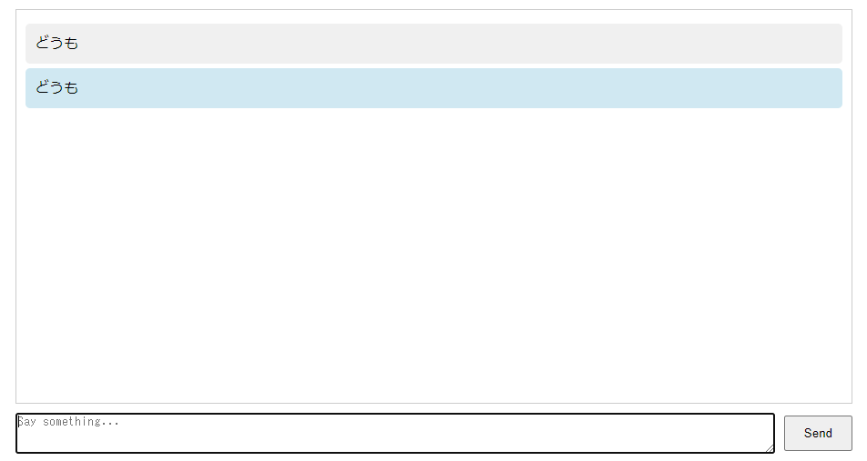

フロントエンドは http://localhost:3000 で、バックエンドは http://localhost:5000 でアクセス可能です。
フロントエンドで入力された内容は http://localhost:5000/chat で適切に処理され返されます。

```
chatbot/
│
├── frontend/        # React フロントエンド用ディレクトリ
│   ├── Dockerfile
│   ├── package.json
│   ├── src/
│   │   ├── App.tsx
│   │   ├── index.css
│   │   └── index.tsx
│   └── public/
│       └── index.html
│
├── backend/         # Flask バックエンド用ディレクトリ
│   ├── Dockerfile
│   ├── app.py
│   └── requirements.txt
│
└── docker-compose.yml

```

画面イメージ


